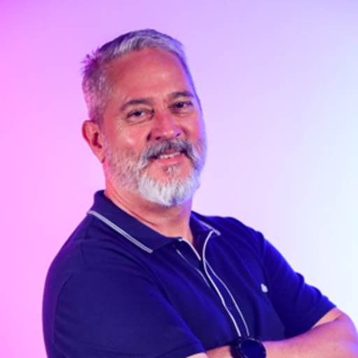

# Inteli - Instituto de Tecnologia e Liderança 

 

# Nome do projeto: Catree solution

## CaTree

## 👨‍🎓 Integrantes: 

Para conhecer mais sobre cada membro, clique em seus nomes ou fotos e visite seus perfis no LinkedIn.
 

  <table>
    <tr>
      <td align="center"><a href="https://www.linkedin.com/in/andre-dleizer/"> André Dleizer</a></td>
      <td align="center"><a href="https://www.linkedin.com/in/carol-pascarelli/"> Carolina Pascarelli</a></td>
       <td align="center"><a href="https://www.linkedin.com/in/felipe-elgenneni/"> Felipe Elgenneni</a></td>
     <td align="center"><a href="https://www.linkedin.com/in/fernanda-correia04/"> Fernanda Correia</a></td>
   </tr>
  </table>

 

  <table>
    <tr>
      <td align="center"><a href="https://www.linkedin.com/in/igor-sguissardi/"> Igor Sguissardi</a></td>
      <td align="center"><a href="https://www.linkedin.com/in/lucca-henrique-pereira/"> Lucca Pereira</a></td>
      <td align="center"><a href="https://www.linkedin.com/in/raul-rezende-szpak-642079186/"> Raul Szpak</a></td>
    </tr>
  </table>

## 👩‍🏫 Professores:

### Coordenador do Curso

  <table>
    <tr>
      <td align="center"><a href="https://www.linkedin.com/in/sergio-venancio-a509b342/"> Sérgio Venâncio</a></td>
    </tr>
  </table>

### Orientador(a) 

  <table>
    <tr>
      <td align="center"><a href="https://www.linkedin.com/in/marcelo-gon%C3%A7alves-phd-a550652/"> Marcelo Gonçalves</a></td>
    </tr>
  </table>

### Instrutores

  <table>
    <tr>
      <td align="center"><a href="https://www.linkedin.com/in/profandregodoi/"> André Godoi</a> Programação</td>
      <td align="center"><a href="https://www.linkedin.com/in/egondaxbacher/"> Egon Daxbacher</a> Negócios</td>
      <td align="center"><a href="https://www.linkedin.com/in/francisco-escobar/"> Francisco Escobar</a> UX e Design</td>
    </tr>
  </table>

 

  <table>
    <tr>
       <td align="center"><a href="https://www.linkedin.com/in/michele-bazana-de-souza-69b77763/"> Michele Bazana</a> Liderança</td>
      <td align="center"><a href="https://www.linkedin.com/in/geraldo-magela-severino-vasconcelos-22b1b220/?originalSubdomain=br"> Geraldo Vasconselos</a> Matemática e física</td>
    </tr>
  </table>

 

## 📜 Descrição
&nbsp;&nbsp;&nbsp;&nbsp; O projeto desenvolvido no Instituto de Pesquisas Tecnológicas (IPT) busca criar uma solução IoT de baixo custo para o monitoramento de equipamentos no Laboratório de Processos Metalúrgicos, com foco principal no compressor de ar. Este equipamento é essencial para diversas operações dentro do laboratório, assim é essencial que esteja sempre disponível para uso para evitar pausas nos processos e custos elevados com manutenções corretivas. A proposta consiste em desenvolver um sistema que monitore, em tempo real, variáveis críticas do compressor, como temperatura para detectar superaquecimento e vibração para detectar quando a máquina está ligada, permitindo ações preventivas e maior controle sobre sua operação.

&nbsp;&nbsp;&nbsp;&nbsp; A nossa solução utiliza sensores de temperatura para identificar aquecimentos excessivos que possam indicar sobrecarga ou possíveis falhas. Além disso, o acelerômetro detecta a vibração, podendo ser utilizado para monitorar o tempo de uso, permitindo que a equipe de manutenção acompanhe o uso da máquina e programe manutenções preventivas, evitando falhas inesperadas. Além disso, um sistema de alerta visual foi implementado com LEDs RGB e um buzzer, que sinalizam diferentes condições do equipamento. Por exemplo, o LED RGB fica vermelho e o buzzer apita em caso de superaquecimento ou funcionamento fora dos parâmetros ideais. O dispositivo também possui botões de controle para que os operadores possam ligar, desligar e resetar o sistema.

&nbsp;&nbsp;&nbsp;&nbsp; Os componentes eletrônicos estão todos protegidos em uma case de acrílico, que assegura a durabilidade e resistência nas condições do laboratório, auxiliando na proteção contra umidade e poeira. A conectividade IoT é outro ponto central da solução. O dispositivo utiliza a rede sem fio já existente no laboratório para transmitir os dados coletados para uma plataforma central de monitoramento. Essa abordagem permite que os operadores acessem informações em tempo real sobre o estado do compressor, recebam notificações de anomalias e analisem dados históricos para identificar padrões e tendências que auxiliem na tomada de decisões mais informadas.

&nbsp;&nbsp;&nbsp;&nbsp; A implementação da nossa solução traz diversos benefícios para o laboratório do IPT. Em primeiro lugar, o monitoramento contínuo contribui para aumentar a vida útil do compressor, evitando desgastes prematuros causados por superaquecimento ou uso prolongado sem intervenções adequadas. Em segundo lugar, ao possibilitar a manutenção preditiva e preventiva, o sistema reduz os custos associados a reparos emergenciais e interrupções não planejadas. Outro benefício importante é a melhoria da segurança operacional, pois os alertas em tempo real permitem respostas rápidas a potenciais problemas, minimizando riscos. Além disso, a conectividade com a rede IoT garante integração e eficiência no gerenciamento dos dados.

&nbsp;&nbsp;&nbsp;&nbsp; A solução desenvolvida, apesar de ter sifo desenvolvida visando o monitoramento do compressor de ar do Laboratório de Processos Metalúrgicos, tem o potencial de ser adaptada para diversas aplicações mudando os sensores e parâmetros que estão sendo utilizados no projeto, auxiliando na gestão de diversos equipamentos do setor industrial.

Inclua um link para o vídeo de demonstração do funcionamento de seu projeto (sprint 5)

## 📁 Estrutura de pastas

Dentre os arquivos e pastas presentes na raiz do projeto, definem-se:

- <b>assets</b>: aqui estão os arquivos relacionados a parte gráfica do projeto, ou seja, as imagens e vídeos que os representam (O logo do grupo pode ser adicionado nesta pasta).

- <b>document</b>: aqui estão todos os documentos do projeto, incluindo o manual de instruções (se aplicável). Há também uma pasta denominada <b>outros</b> onde estão presentes outros documentos complementares.

- <b>src</b>: Todo o código fonte criado para o desenvolvimento do projeto, incluindo firmware, notebooks, backend e frontend, se aplicáveis.

- <b>README.md</b>: arquivo que serve como guia e explicação geral sobre o projeto (o mesmo que você está lendo agora).

## 🔧 Instalação

### 🔧 Instalação

Para configurar o ambiente de desenvolvimento do projeto IoT utilizando ESP32 e sensores, siga as etapas abaixo. Este guia cobre as bibliotecas e ferramentas necessárias para implementar as funcionalidades descritas no projeto.

#### **Instalação**

1. **Configuração do Ambiente:**
   - Baixe e instale o [Arduino IDE](https://www.arduino.cc/en/software).
   - Vá para `Tools > Board > Boards Manager`, pesquise por `esp32` e instale o pacote correspondente.

2. **Importação das Bibliotecas:**
   - No Arduino IDE, acesse `Sketch > Include Library > Manage Libraries`.
   - Pesquise e instale as seguintes bibliotecas:
     - **Adafruit Unified Sensor**: Biblioteca genérica para sensores da Adafruit.
     - **DHT sensor library**: Para sensores de temperatura e umidade.
     - **Wire**: Para comunicação I2C.
     - **LiquidCrystal_I2C**: Para uso com telas LCD via protocolo I2C.
     - **MPU6050_tockn**: Biblioteca para leitura e processamento de dados do sensor MPU6050.

3. **Conexão e Configuração do Hardware:**
   - Conecte o ESP32 ao computador usando um cabo USB.
   - Certifique-se de selecionar o ESP32 em `Tools > Board` e a porta correta em `Tools > Port`.

4. **Carregamento do Código:**
   - Insira ou importe o código do projeto no Arduino IDE.
   - Compile e faça o upload para o ESP32. Certifique-se de que não há erros durante o processo.
   - Certifique-se que o ESP32 está conectado a internet.

5. **Dashboard Online:**
   - Abra a plataforma [UbiDots](https://inteli-ubidots.iot-application.com/).
   - Faça login com as credenciais recebidas.
   - Acesse o dashboard T12-G02.

[Manual de Instrucoes](https://docs.google.com/document/d/1wNrLoWCiSc8wVzibczfrh-hBtERGHqqf/edit?usp=sharing&ouid=106959847174655627258&rtpof=true&sd=true)

## 🗃 Histórico de lançamentos

* 0.5.0 - 19/12/2024
    * Entrega final:
    * Protópipo entregue completo
    * Documentação completa

* 0.4.0 - 06/12/2024
    * Quarta entrega:
    * Protótipo conectado ao Ubidots 
    * Código otimizado
    * Manual de instruções
    * Desenvolvimento da caixa do embarcado
    
* 0.3.0 - 22/11/2024
    * Terceira entrega:
    * Integração com o dashboard Ubidots
    * adição dos protocolos de comunicação MQTT e I2C
    * Arquitetura virtual da solução 
    
* 0.2.0 - 08/11/2024
    * Segunda entrega:
    * Protótipo físico (offline)
    * Requisitos não fucionais 
    * Jornada do Usuário 
    * Storyboard

* 0.1.0 - 15/10/2024
    * Primeira entrega:
    * Análises e modelo de negócios
    * Protótipo inicial do Projeto no simulador
    * Requisitos funcionais

## 📋 Licença/License

<a property="dct:title" rel="cc:attributionURL" href="https://github.com/Inteli-College/2024-2B-T12-IN04-G02.git">CaTree</a> by <a rel="cc:attributionURL dct:creator" property="cc:attributionName" href="https://github.com/InteliProjects">Inteli</a>, <a property="dct:title" rel="cc:attributionURL" href="https://www.linkedin.com/in/andre-dleizer/">André Dleizer</a>, <a property="dct:title" rel="cc:attributionURL" href="https://www.linkedin.com/in/carol-pascarelli/">Carolina Pascarelli</a>, <a property="dct:title" rel="cc:attributionURL" href="https://www.linkedin.com/in/felipe-elgenneni/">Felipe Elgenneni</a>, <a property="dct:title" rel="cc:attributionURL" href="https://www.linkedin.com/in/fernanda-correia04/">Fernanda Correia</a>, <a property="dct:title" rel="cc:attributionURL" href="https://www.linkedin.com/in/igor-sguissardi/">Igor Sguissardi</a>, <a property="dct:title" rel="cc:attributionURL" href="https://www.linkedin.com/in/lucca-henrique-pereira/">Lucca Pereira</a>, <a property="dct:title" rel="cc:attributionURL" href="https://www.linkedin.com/in/raul-rezende-szpak-642079186/">Raul Szpak</a> is licensed under <a href="http://creativecommons.org/licenses/by/4.0/?ref=chooser-v1" target="_blank" rel="license noopener noreferrer" style="display:inline-block;">Attribution 4.0 International</a>.
