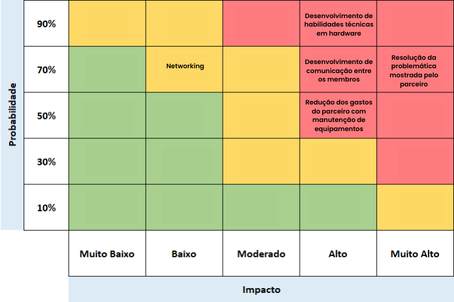

# Documentação IoTDoc - Módulo 4 - Inteli


## CaTree

### Membros:

Para conhecer mais sobre cada membro, clique em seus nomes e visite seus perfis no GitHub.

[**André Dleizer**](https://github.com/andrepradointeli)

[**Carolina Pascarelli**](https://github.com/carol-pascarelli)

[**Felipe Elgenneni**](https://github.com/ElgenneniF)

[**Fernanda Correia**](https://github.com/fernanda-correia)

[**Igor Sguissardi**](https://github.com/igorSguissardi)

[**Lucca Pereira**](https://github.com/LuccaHP)

[**Raul Szpak**](https://github.com/raulszpak)


## Sumário

[1. Introdução](#c1)

[2. Metodologia](#c2)

[3. Desenvolvimento e Resultados](#c3)

[4. Conclusões e Recomendações](#c4)

[5. Referências](#c5)

<br>


# <a name="c1"></a>1. Introdução

&nbsp;&nbsp;&nbsp;&nbsp;O Instituto de Pesquisas Tecnológicas (IPT) é uma instituição vinculada ao Governo do Estado de São Paulo, localizada na cidade de São Paulo.  é uma das mais antigas e respeitadas instituições de pesquisa e desenvolvimento no Brasil, com atuação desde 1899. Reconhecido nacional e internacionalmente, sua atuação abrange setores como indústria, energia e meio ambiente, além de oferecer suporte técnico a governos e à sociedade na resolução de desafios complexos. Com infraestrutura de ponta e equipes multidisciplinares, o instituto atua em pesquisa, serviços tecnológicos, metrologia e educação em tecnologia.

&nbsp;&nbsp;&nbsp;&nbsp;O problema identificado está relacionado ao monitoramento de mais de 500 equipamentos no Laboratório de Processos Metalúrgicos do IPT. Esses equipamentos, que operam sob demanda, necessitam de monitoramento contínuo para otimizar a manutenção, reduzir custos, prolongar sua vida útil e aumentar sua disponibilidade operacional.

## 1.1 Objetivos

&nbsp;&nbsp;&nbsp;&nbsp;Os objetivos gerais do projeto envolvem a redução dos custos de manutenção, o aumento da durabilidade dos equipamentos e a garantia de que as máquinas estejam operacionais sempre que necessário. Para isso, busca-se implementar um monitoramento preventivo eficiente, que permita identificar condições adversas antes que elas causem falhas mais graves.

&nbsp;&nbsp;&nbsp;&nbsp;Já os objetivos específicos incluem o desenvolvimento de um dispositivo de baixo custo para monitorar variáveis como temperatura, tempo de funcionamento em tempo real e vibração. Além disso, pretende-se criar um sistema de alertas automáticos para manutenção preditiva, integrar a solução à infraestrutura de IoT existente, proteger o dispositivo contra condições ambientais agressivas e gerar relatórios detalhados para apoiar decisões de manutenção.

&nbsp;&nbsp;&nbsp;&nbsp;Os objetivos do parceiro, representado pelo Instituto de Pesquisas Tecnológicas (IPT), incluem a redução de custos operacionais, o aumento da vida útil dos equipamentos e a garantia de sua disponibilidade operacional. O IPT busca, também, implementar inovações tecnológicas que facilitem o monitoramento contínuo dos equipamentos no Laboratório de Processos Metalúrgicos, mesmo em um ambiente sujeito a poeira, água e ruídos. A proposta visa, assim, assegurar que os ativos estejam sempre prontos para atender às demandas dos ensaios e projetos realizados, promovendo maior eficiência e otimização dos recursos disponíveis.

&nbsp;&nbsp;&nbsp;&nbsp;Esses objetivos foram projetados para atender diretamente às necessidades do Laboratório de Processos Metalúrgicos, promovendo uma gestão mais eficaz dos equipamentos e aumentando sua disponibilidade para os projetos realizados no IPT.

## 1.2 Proposta da solução

&nbsp;&nbsp;&nbsp;&nbsp;A solução proposta é um sistema IoT de baixo custo para o monitoramento contínuo do equipamento do compressor de ar do laboratório de metalurgia do IPT. O sistema utilizará sensores para coletar dados como temperatura, tempo de funcionamento e vibração, permitindo identificar sinais de falha, como superaquecimento. Quando esses sinais forem detectados, alertas serão gerados para possibilitar ações de manutenção imediatas, reduzindo o risco de falhas inesperadas e pausas na produção.

&nbsp;&nbsp;&nbsp;&nbsp;Além disso, o projeto inclui o desenvolvimento de um _dashboard_ que permitirá aos operadores ajustar os parâmetros dos alertas e monitorar as condições das máquinas em tempo real. Com essa ferramenta, será possível personalizar limites, como a temperatura considerada superaquecimento, garantindo maior precisão no acompanhamento e na resposta a potenciais problemas.

## 1.3 Justificativa

&nbsp;&nbsp;&nbsp;&nbsp;A proposta foi desenvolvida com base em uma análise detalhada das necessidades apresentadas pelo IPT e nas recomendações do líder técnico do projeto. A solução IoT destaca-se por ser uma alternativa de baixo custo, com componentes de fácil aquisição e integração. Ela é capaz de oferecer monitoramento preciso e confiável, sendo ideal para ambientes industriais desafiadores.

&nbsp;&nbsp;&nbsp;&nbsp;Os benefícios incluem a redução dos custos de manutenção por meio da detecção precoce de sinais de desgaste, promovendo intervenções pontuais antes que ocorram falhas maiores. Essa abordagem diminui a necessidade de reparos extensos ou substituições completas de equipamentos, contribuindo para um uso mais eficiente dos recursos financeiros. Além disso, a maior disponibilidade operacional das máquinas permite que o laboratório amplie sua capacidade produtiva e seu impacto no setor. Essa solução, portanto, favorece o IPT na manutenção de sua posição de destaque no mercado, enquanto promove inovação e sustentabilidade em suas operações.

# <a name="c2"></a>2. Metodologia 

&nbsp;&nbsp;&nbsp;&nbsp; A metodologia RM-ODP (Reference Model for Open Distributed Processing) é um modelo de referência em ciência da computação que fornece uma estrutura para a padronização do processamento distribuído aberto. Ela suporta a distribuição, a interação e a independência de plataforma e tecnologia, além de garantir portabilidade e uma estrutura de arquitetura empresarial para especificações do sistema ODP.

&nbsp;&nbsp;&nbsp;&nbsp; Esta metodologia foi utilizada para auxiliar na estruturação do desenvolvimento do projeto, fornecendo uma visão organizada para o sistema e garantindo que todos os aspectos necessários para o nosso sistema fossem considerados. O RM-ODP possui 5 visões fundamentais, sendo elas:

1. **Visão computacional:** descreve a funcionalidade do sistema em relação a objetos interagindo por interfaces definidas. Essa visão mostra como os componentes irão se comunicar e coordenar as funções, definindo grupos de objetos em subssistemas e suas interações. Ela também espeifica quais serviços e funções cada um dos componentes deve fornecer para garantir a colaboração entre os elementos do sistema.

2. **Visão de informação:** foca nos dados que serão representados, manipulados e armazenados no nosso sistema, garantindo a consistência e padronização das informações. Aborda também a integridade e a segurança dos dados, especificando como a informação pe atualizada, acessada e protegida. 

3. **Visão de negócio:** estabelece a política e os objetivos de negócio do nosso sistema, descrevendo o propósito, papéis e processos de alto nível para alinhar o desenvolvimento com as necessidades organizacionais. Além disso, considera como o sistema impactará os processos e práticas da organização, criando requisitos que refletem metas estratégicas e operacionais. 

4. **Visão da engenharia:** trata da infraestrutura que irá suportar a distribuição e conexão dos componentes do sistema, abordando requisitos de conectividade e comunicação entre os elementos. Também detalha aas tecnologias da rede, protocolos de comunicação, como lidar com falhas e latência, e as estratégias para garantir a confiabilidade do sistema. 

5. **Visão Tecnológica:** foca nos padrões, nas tecnologias e nos protocolos que serão utilizados no desenvolvimento, especificando os requisitos de compatbilidade e interoperabilidade com outras soluções. Também define as plataformas e frameworks que vão auxiliar o desenvolvimento, como linguagem de programação, bibliotecas, APIs e sistemas operacionais. 

<div align="center">
<sub>Figura 1 - Visões da RM-ODP </sub><br>
<br>
<sup>Fonte: Material produzido pelos autores (2024)</sup>
</div> 

<br>
&nbsp;&nbsp;&nbsp;&nbsp;Essas cinco visões oferecem uma estrutura organizada e completa para o desenvolvimento de sistemas distribuídos, garantindo que cada camada do projeto seja considerada desde as etapas iniciais do processo. Com o uso da RM-ODP, o desenvolvimento se torna mais alinhado com as necessidades da organização e preparado para integrar novas tecnologias. Dessa forma, épossível garantir um sistema seguro e flexível, que consegue suportar desafios de uma rotina real e crescer de maneira eficiente e integrada no ambiente. 
<br>

# <a name="c3"></a>3. Desenvolvimento e Resultados 

&nbsp;&nbsp;&nbsp;&nbsp; Essa seção serve como um apoio teórico e de pesquisas para embasar as regras de negócio do sistema IoT, isso garante que não apenas as especificidades técnicas sejam atendidas, mas também as necessidades empresariais e econômicas do IPT.

## 3.1. Domínio de Fundamentos de Negócio

&nbsp;&nbsp;&nbsp;&nbsp; O fundamento de negócio é indispensável para o entendimento das necessidades empresariais e econômicas do IPT, por isso, ao logo desta subseção serão apresentados vários _canvas_ com informações relevantes sobre o contexto do Instituto de Pesquisas Tecnológicas.

### 3.1.1. Contexto da Indústria

&nbsp;&nbsp;&nbsp;&nbsp; O Instituto de Pesquisas Tecnológicas (IPT) está inserido em um mercado de Pesquisa e Desenvolvimento (P&D) altamente dinâmico e em expansão no Brasil, refletido pelo tamanho significativo desse setor, que movimentou aproximadamente R$ 50 bilhões em 2023, com projeções de alcançar R$ 60 bilhões até 2025. Este crescimento anual composto de cerca de 5% nos últimos cinco anos é impulsionado pela crescente demanda por inovação tecnológica, digitalização de processos industriais e a busca por soluções sustentáveis em diversos setores, como energia, construção civil e meio ambiente. A dinâmica do mercado de P&D no Brasil é caracterizada por uma interação cada vez maior entre instituições públicas, privadas e acadêmicas, onde a colaboração e a digitalização estão transformando os métodos de pesquisa e inovação. A automação e o uso de tecnologias avançadas como inteligência artificial (IA) estão se tornando centrais para os avanços nas áreas industriais e de sustentabilidade, moldando a dinâmica do mercado de maneira significativa.

&nbsp;&nbsp;&nbsp;&nbsp; O IPT opera em um ambiente competitivo moderado, enfrentando concorrência de diversas instituições públicas, privadas e acadêmicas que oferecem serviços semelhantes. Entre os principais concorrentes estão a Embrapii, que promove inovação industrial, o CENPES da Petrobras, especializado em pesquisas para o setor energético, e centros de pesquisa acadêmica como a USP e a UNICAMP, além de empresas privadas como Stefanini e TOTVS, que fornecem consultoria tecnológica. A estratégia competitiva do IPT baseia-se em sua longa tradição, fundada em 1899, e em uma infraestrutura robusta com laboratórios altamente especializados e equipamentos de última geração. Este histórico confere ao IPT uma reputação consolidada no mercado, diferenciando-o de concorrentes que podem ter focos mais limitados ou abordagens mais ágeis, como as empresas privadas que tendem a ser mais flexíveis e especializadas em nichos específicos. Comparado com universidades, que se concentram mais na pesquisa acadêmica e na formação de profissionais, o IPT oferece serviços mais voltados para a aplicação industrial e consultoria técnica, atendendo a múltiplos setores e mantendo parcerias sólidas com a indústria.

&nbsp;&nbsp;&nbsp;&nbsp; O modelo de negócios do IPT é diversificado, baseando-se na monetização através de contratos de P&D, consultoria técnica, ensaios laboratoriais, licenciamento de tecnologias e oferta de cursos e treinamentos. Este modelo demanda investimentos elevados em infraestrutura e recursos humanos altamente qualificados, refletindo os custos operacionais necessários para manter a excelência e a inovação contínua. A cadeia de valor do IPT abrange desde a pesquisa aplicada e o desenvolvimento de protótipos até a consultoria, certificação e transferência de tecnologia, posicionando o instituto como um parceiro essencial para empresas que buscam inovação e melhoria de processos. Recentemente, o IPT tem investido em áreas emergentes como nanotecnologia, inteligência artificial, biocombustíveis e tecnologias sustentáveis, ampliando sua capacidade de fornecer soluções tecnológicas de ponta e mantendo-se na vanguarda das inovações industriais.

&nbsp;&nbsp;&nbsp;&nbsp; Dentro desse contexto, o subsetor de usinagem emerge como uma área crucial para o IPT. A usinagem envolve processos de manufatura de precisão, essenciais para a indústria metalmecânica e outros setores que demandam peças e componentes de alta complexidade e qualidade, como os setores automotivo, aeroespacial, de energia e de bens de capital. O IPT oferece serviços especializados nesse campo, que vão desde o desenvolvimento de protótipos até a execução de testes rigorosos de durabilidade e resistência de materiais. Este subsetor é particularmente relevante no cenário de manufatura avançada, onde a automação, o uso de CAD/CAM (desenho assistido por computador/manufatura assistida por computador) e a integração com a Indústria 4.0 são cada vez mais predominantes. O IPT contribui significativamente para o desenvolvimento de processos de manufatura mais eficientes e sustentáveis, realizando pesquisas em técnicas de usinagem de materiais de difícil conformação, como ligas metálicas especiais, cerâmicas e compósitos, amplamente utilizados na indústria de ponta.

&nbsp;&nbsp;&nbsp;&nbsp; Além disso, o IPT está na vanguarda da implementação de soluções de monitoramento e controle de máquinas em tempo real, utilizando sensores inteligentes e sistemas de controle para melhorar a eficiência e reduzir falhas no processo produtivo, alinhando-se com as tendências da Indústria 4.0. O instituto também realiza ensaios de desgaste de ferramentas de corte e avaliações de desempenho de materiais usados em processos de usinagem, ajudando as empresas a aumentar a vida útil de seus equipamentos e a otimizar a escolha de materiais para fabricação. No setor de alta precisão, como o aeroespacial, o IPT apoia indústrias com ensaios de precisão, avaliação de superfícies e testes de resistência à fadiga, garantindo que as peças usinadas atendam a padrões rigorosos de qualidade. Ademais, o IPT desenvolve processos de usinagem que minimizam o uso de fluidos de corte, reduzindo custos operacionais e impactos ambientais, em consonância com as tendências globais de manufatura sustentável. Segue um diagrâma que representa as 5 Forças de Porter para o IPT:

<div align="center">
<sub>Figura 2 - Cinco Forcas de Porter</sub><br>
<br>
<sup>Fonte: Material produzido pelos autores (2024)</sup>
</div> 

&nbsp;&nbsp;&nbsp;&nbsp; No que tange às Cinco Forças de Porter, a análise revela que o IPT opera em um ambiente com barreiras de entrada significativas, como o alto investimento em infraestrutura e a necessidade de conhecimento técnico especializado, resultando em uma ameaça de novos entrantes relativamente baixa a moderada. O poder de negociação com fornecedores é moderado, já que o IPT depende de fornecedores especializados para equipamentos laboratoriais avançados, embora a diversificação de fornecedores e a escala das operações reduzam a influência individual dos fornecedores. Quanto ao poder de negociação dos clientes, a base diversificada de clientes do IPT, que inclui grandes indústrias, governos e instituições acadêmicas, dilui o poder de negociação individual, embora contratos de grande porte possam conferir maior influência a alguns clientes específicos. A ameaça de produtos ou serviços substitutos é moderada, com a presença de consultorias privadas de P&D, startups tecnológicas e parcerias acadêmicas oferecendo alternativas, mas a proposta de valor integrada e a expertise do IPT mitigam essa ameaça. Por fim, a rivalidade entre os concorrentes existentes é moderada, sustentada pela necessidade de inovação contínua e pela presença de múltiplos players no mercado, sendo que a reputação estabelecida do IPT e sua capacidade de oferecer serviços diferenciados mantêm sua posição competitiva sólida.

&nbsp;&nbsp;&nbsp;&nbsp; O setor de parceiros do IPT abrange uma ampla gama de indústrias e instituições que se beneficiam dos serviços de P&D oferecidos, incluindo a indústria automobilística, construção civil, energia, meio ambiente e tecnologia da informação. A interação com esses parceiros ocorre através de colaborações em projetos de P&D, consultoria técnica, ensaios laboratoriais, transferência de tecnologia e programas de capacitação e treinamento. Essas parcerias são fundamentais para o modelo de negócio do IPT, permitindo a expansão da capacidade de inovação, a diversificação de receitas e o fortalecimento da reputação da instituição. As parcerias estratégicas também facilitam o acesso a novas tecnologias e práticas inovadoras, mantendo o IPT na vanguarda do desenvolvimento tecnológico no Brasil.

&nbsp;&nbsp;&nbsp;&nbsp; Adicionalmente, as tendências de mercado que impactam o IPT incluem a crescente digitalização e a adoção de tecnologias da Indústria 4.0, que exigem pesquisas cada vez mais avançadas e integradas com IoT, big data e automação. A sustentabilidade e a economia circular são fatores determinantes, impulsionando a demanda por soluções verdes e eficientes. A aplicação de inteligência artificial e machine learning em projetos de pesquisa permite ao IPT desenvolver soluções mais rápidas e eficazes, enquanto as parcerias público-privadas proporcionam acesso a novos financiamentos e tecnologias. A globalização da inovação facilita colaborações internacionais, ampliando o alcance e a influência do IPT. Um desafio constante é atender à crescente demanda por personalização dos serviços, exigindo que o IPT mantenha-se ágil e adaptável para responder às necessidades específicas de seus clientes.

&nbsp;&nbsp;&nbsp;&nbsp; Em suma, o Instituto de Pesquisas Tecnológicas está bem posicionado no mercado brasileiro de P&D, com uma sólida infraestrutura, uma ampla gama de serviços e parcerias estratégicas que fortalecem sua posição competitiva. A inclusão do subsetor de usinagem destaca ainda mais a capacidade do IPT de atender a demandas específicas e de alta precisão, demonstrando sua versatilidade e compromisso com a inovação e a sustentabilidade. Apesar dos desafios decorrentes da concorrência moderada e da necessidade de inovação contínua, o IPT mantém uma vantagem competitiva significativa devido à sua tradição, infraestrutura avançada e expertise técnica. Para sustentar e aprimorar sua posição no mercado, é essencial que o IPT continue a investir em inovação, diversificação de serviços e fortalecimento de suas parcerias estratégicas, adaptando-se às tendências emergentes e às dinâmicas do mercado para garantir sua relevância e liderança no setor de P&D no Brasil.

### 3.1.2. Análise SWOT

&nbsp;&nbsp;&nbsp;&nbsp; A matriz SWOT é uma ferramenta de análise estratégica usada para avaliar os fatores internos e externos que impactam uma organização. Ela é composta por quatro quadrantes: Forças (Strengths), que são as vantagens internas; Fraquezas (Weaknesses), que são os pontos de melhoria internos; Oportunidades (Opportunities), que representam fatores externos favoráveis; e Ameaças (Threats), que são fatores externos que podem impactar negativamente. Essa análise auxilia na formulação de estratégias e no planejamento para otimizar o desempenho da organização. 

<div align="center">
<sub>Figura 3 - Matriz de Riscos</sub><br>
<br>
<sup>Fonte: Material produzido pelos autores (2024)</sup>
</div> 

#### Strength

**Ecossistema de inovação:** O IPT se destaca por seu amplo ecossistema de inovação, que integra diversos agentes do setor público, privado e acadêmico. Isso fortalece a rede de contatos entre tais agentes, favorecendo a troca de conhecimentos e fomentando a participação conjunta em projetos de alta complexidade, isso impulsiona a inovação.

**Equipe qualificada:** O IPT conta com uma equipe composta por profissionais altamente capacitados e especializados em diferentes áreas de atuação, o que permite a execução de projetos de ponta, com expertise técnica e científica aprofundada.

**Tecnologia de ponta:** Com uma infraestrutura e equipamentos de qualidade, o IPT está preparado para desenvolver soluções tecnológicas complexas, com foco em projetos inovadores e "hardtech".

**Experiência comprovada:** O IPT tem um histórico sólido de projetos bem-sucedidos, consolidando-se como referência no mercado de pesquisa e desenvolvimento no Brasil. Sua expertise acumulada fortalece a confiança em sua capacidade de entregar resultados de impacto.

#### Weakness

**Burocracia interna:** O Instituto enfrenta desafios com processos internos que podem ser excessivamente burocráticos e lentos, o que impacta diretamente a agilidade na implementação de novos projetos. Isso pode reduzir sua competitividade em mercados que demandam soluções rápidas, criando barreiras para o desenvolvimento de inovações em prazos menores.

**Dependência de financiamento externo:** O IPT depende significativamente de financiamento governamental e de parcerias externas, o que pode limitar sua autonomia em decisões estratégicas. Essa vulnerabilidade financeira pode comprometer o andamento de projetos, especialmente em períodos de restrições orçamentárias.

#### Opportunity

**Demanda crescente por inovação tecnológica:** O aumento da demanda por soluções tecnológicas em diversos setores coloca o IPT em uma posição de destaque, com a capacidade de atender às necessidades emergentes de mercados que buscam inovação e pesquisa aplicada.

**Parcerias com Startups de Tecnologia:** O crescente ecossistema de startups de tecnologia oferece uma oportunidade para o IPT colaborar em projetos de pesquisa e desenvolvimento focados em inovação rápida e ágil. Parcerias com startups podem trazer novas perspectivas e acelerar a aplicação de pesquisas em soluções práticas.

#### Threat
**Concorrência internacional:** O IPT enfrenta uma concorrência de centros de pesquisa estrangeiros que possuem acesso a maior financiamento e infraestrutura tecnológica de ponta. Essa disparidade de recursos pode impactar a competitividade do IPT num contexto de cenário global, especialmente em áreas que exigem inovações tecnológicas avançadas e rápidas.

**Impacto das reduções de financiamento e mudanças regulatórias:** A redução de verbas públicas e as constantes mudanças regulatórias governamentais podem prejudicar significativamente o desenvolvimento de projetos de pesquisa, limitando os recursos disponíveis e afetando a continuidade de iniciativas estratégicas da instituição.

### 3.1.3. Descrição da Solução a ser Desenvolvida

#### 3.1.3.1 Qual é o problema a ser resolvido

&nbsp;&nbsp;&nbsp;&nbsp; Atualmente, o IPT não possui um sistema eficiente de monitoramento contínuo para os equipamentos do laboratório de metalurgia, como o compressor de pistão de Schulz e a Máquina Universal de Ensaios EMIC. Esses equipamentos são utilizados até apresenatarem falhas ou quebrarem, não tendo um controle mais preciso para saber quando devem ser feitas suas manutenções preventivas. Isso ocasiona em paradas inesperadas dos equipamentos, o que gera tanto um prejuízo na manutenção de algo que poderia ter sido evitado quanto perdas na linha de produção, já que outros equipamentos no laboratório são dependentes destes. 

#### 3.1.3.2 Qual a solução proposta (visão de negócios)

&nbsp;&nbsp;&nbsp;&nbsp; A solução proposta pelo nosso grupo é o desenvolvimento de um sistema de monitoramento contínuo e de baixo custo que coleta dados em tempo real sobre o estado e o desempenho destes equipamentos do labortório. O sistema conseguirá monitorar parâmetros como temperatura, vibração e tempo de uso, identificando desvios e possíveis falhas com base em limites predefinidos que podem gerar danos à saúde do maquinário. Além disso, pretendemos desenvolver um dashboard que dê acesso mais fácil a estas informações para que os funcionários responsáveis pela manutenção possam acompanhar de maneira mais otimizada. 

#### 3.1.3.3 Como a solução proposta deverá ser utilizada

&nbsp;&nbsp;&nbsp;&nbsp; O sistema desenvolvido deverá ser utilizado pelos operadores e técnicos de manutenção do IPT para monitorar os equipamentos em tempo real. Eles poderão acessar uma interface (dashboard) amigável onde serão exibidos os dados de uso e alertas, que refletem padrões de dados captados pelo sensores do embarcado, para monitorar o compressor serão utilizados um sensor de temperatura e um acelerômetro, para medir aquecimentos fora do normal, e para verificar se o equipamento está ligado(ele só vibra se estiver ligado), respectivamente. Os sensores do compressor ficarão fixados nele, provavelmente próximo aos pistões. O sistema permitirá definir e ajustar limites operacionais para o equipamento, conforme a necessidade do usuário. Além disso, no exterior da máquina haverá LEDs indicando se o funcionamento daquela máquina é adequado. 

#### 3.1.3.4 Quais os benefícios trazidos pela solução proposta

&nbsp;&nbsp;&nbsp;&nbsp; Os principais benefícios trazidos pela solução incluem:
* **Redução de paradas inesperadas:** Ao detectar falhas, divergências ou necessidade de manutenção irá emitir notificações, reduzindo a ocorrência de falhas inesperadas.
* **Aumento da vida útil dos equipamentos:** Manutenções preventivas realizadas com base no monitoramento contínuo ajudarão a manter os equipamentos em melhores condições operacionais. 
* **Melhora na produtividade:** A redução de paradas não planejadas e a manutenção preditiva garantirão que os equipamentos estejam sempre disponíveis e funcionando.
* **Otimização dos custos de manutenção:** A solução irá permitir um planejamento mais eficiente das intervenções, evitando manutenções mais caras e desnecessárias. 

#### 3.1.3.5 Qual será o critério de sucesso e qual medida será utilizada para o avaliar

&nbsp;&nbsp;&nbsp;&nbsp; O sucesso da solução será medido pela redução de paradas inesperadas custo de manutenções emmergenciais e o aumento da vida útil dos equipamentos. As principaus métricas que serão utilizadas para avaliar o sucesso são:
* **Redução no número de manutenções emergenciais:** Monitorar se os custos de manutenções preventivas são menores do que os custos de manutenções desnecessárias e emergenciais quando há a quebra dos equipamentos.
* **Aumento da disponibilidade dos equipamentos:** Avaliar o tempo total de operação sem falhas após a implementação do sistema.
* **Satisfação dos usuários:** Avaliar a facilidade de uso do sistema e a eficácia percebida na melhoria das operações pelos técnicos e operadores. 
* **Aumento da vida útil dos equipamentos:** Monitorar se os equipamentos estão sendo utilizados durante mais tempo antes da necessidade de serem substituídos. 
	
### 3.1.4. Value Proposition Canvas	

&nbsp;&nbsp;&nbsp;&nbsp;O Canva de Proposta de Valor detalha os elementos que contribuirão para o desenvolvimento do projeto, focando em incluir a realidade do parceiro e oferecer uma solução que corresponda às expectativas do IPT (Instituto de Pesquisas Tecnológicas). Segundo Philip Kotler, considerado o pai do marketing moderno, a proposta de valor é um conjunto de benefícios ou valores prometidos aos clientes para atender suas necessidades. Assim, a abordagem envolve uma análise das necessidades e desafios específicos do parceiro, garantindo que a solução seja adequada, eficaz e individualizada. Utiliza-se o Canva de Proposta de Valor como uma forma clara e objetiva de definir o "fit" entre o segmento de clientes e a proposta de valor. Com base nisso, o Value Proposition Canvas foi elaborado de acordo com a solução desenvolvida.

<div align="center">
<sub><a name="f"></a>Figura 4 - Value Proposition Canvas</sub>

<sup>Fonte: Material produzido pelos autores (2024)</sup>
</div>

&nbsp;&nbsp;&nbsp;&nbsp; Na seção "Proposta de Valor", há três componentes principais destacados na figura, que buscam trazer o papel da universidade no modelo de negócios:

1. Produtos e Serviços: 
    Desenvolvimento de dispositivos de monitoramento de baixo custo, integrados a uma plataforma centralizada que permite o monitoramento em tempo real das condições dos equipamentos, independentemente da alocação de projetos.

2. Criadores de Ganho: 
    O dispositivo proporciona uma redução significativa nos custos de manutenção, aumenta a vida útil dos equipamentos e otimiza o tempo de operação, proporcionando maior disponibilidade para uso em ensaios e projetos.

3. Aliviadores de Dor: 
    Automatiza o processo de monitoramento, eliminando a necessidade de verificações manuais e reativas, e reduz o risco de falhas inesperadas que poderiam comprometer o andamento dos projetos.

&nbsp;&nbsp;&nbsp;&nbsp; Na seção "Segmentos de Clientes", também existem três componentes principais destacados na figura, que buscam trazer o papel do cliente no modelo de negócios:

1. Trabalhos do Cliente:
    Os clientes têm a responsabilidade de garantir a manutenção contínua de mais de 500 equipamentos no laboratório de processos metalúrgicos. Isso envolve monitorar suas condições para evitar falhas inesperadas, otimizar o uso dos recursos e assegurar que os equipamentos estejam disponíveis quando necessários para projetos e ensaios. O monitoramento eficaz também deve ocorrer de forma independente, mesmo quando os equipamentos estão ociosos.

2. Ganhos: 
    O principal ganho para o cliente será a capacidade de antecipar problemas nos equipamentos, permitindo intervenções de manutenção antes que ocorram falhas graves. Isso levará a um uso mais eficiente dos equipamentos, aumento da disponibilidade e redução de custos de manutenção. Outro benefício é a tranquilidade proporcionada pela confiabilidade do monitoramento contínuo, mesmo sem a necessidade de alocar recursos humanos constantemente.
3. Dores: 
    As principais dores dos clientes incluem o alto risco de falhas nos equipamentos devido à falta de monitoramento contínuo, o que pode resultar em paradas inesperadas, aumento de custos de manutenção corretiva, e perda de disponibilidade dos equipamentos. A ausência de um sistema automatizado torna o processo de monitoramento mais reativo e menos eficiente, aumentando o desgaste das máquinas e encurtando sua vida útil.

&nbsp;&nbsp;&nbsp;&nbsp;Por fim, a proposta de valor traçada no canva proporciona uma visão abrangente de como a a idea proposta abordará as necessidades e desafios específicos do parceiro. Por meio da análise detalhada das necessidades e da criação de uma solução específica, o projeto visa não apenas atender aos requisitos imediatos, mas agregar valor substancial a longo prazo. Essa abordagem contribui para que o desenvolvimento do projeto permaneça orientado para resultados práticos e positivos para os dois lados.

### 3.1.5. Matriz de Riscos e Oportunidades

&nbsp;&nbsp;&nbsp;&nbsp;A Matriz de Riscos é uma ferramenta de gestão de riscos, que mapeia a probabilidade de ameaças acometerem o andamento do projeto, tal qual o impacto que elas desempenham no desenvolvimento final. Seu objetivo central é a mitigação dos riscos identificados, e portanto, ele conta com um plano de prevenção que assegura o progresso adequado do projeto.

<div align="center">
<sub>Figura 5 - Matriz de Riscos</sub><br>
<br>
<sup>Fonte: Material produzido pelos autores (2024)</sup>
</div> 

#### 3.1.5.1. Baixos Riscos

1. Doenças de membros do grupo:

&nbsp;&nbsp;&nbsp;&nbsp;**Descrição:** Existe uma grande possibilidade de membros do grupo serem acometidos por doenças que os impeçam de realizar suas tarefas temporariamente. Devido a isso, o trabalho geral da *sprint* seria atrasado, sobretudo em *tasks* que possuem dependências relativas àquele desenvolvimento impedido. No entanto, a organização das equipes permite que todos os membros estejam atualizados no andamento das tarefas, e caso seja necesária a delegação de funções, qualquer indivíduo estaria apto a realizá-las. 

&nbsp;&nbsp;&nbsp;&nbsp;**Plano de resposta ao risco:** Buscando mitigar essa ameaça, é necessária a comunicação de inatividade o mais rápido possível, e a redefinição de tarefas durante as *dailys* de forma a não sobrecarregar nenhum membro e garantir a entrega no prazo correto.

2. Atrasos na entrega:

&nbsp;&nbsp;&nbsp;&nbsp;**Descrição:** Apesar de desempenhar um baixo risco, eventuais atrasos na entrega possuem um impacto moderado no projeto final, visto que além de atrasar o planejamento dos parceiros, reduz a confiança dada ao trabalho da equipe. Além disso, pode-se citar a chance de sobrecarregar os membros devido a quantidade de trabalho a ser realizada durante os períodos de compensar as demoras.

&nbsp;&nbsp;&nbsp;&nbsp;**Plano de resposta ao risco:** Realizar as *dailys* com cuidado e atenção, buscando entender os prazos necessários para cada *task* e manter a fiscalização constante das *deadlines*. Caso o grupo identifique a necessidade de estender eventuais prazos para o cumprimento das tarefas com qualidade, o professor deve ser notificado o mais rápido possível e analisar se esse pedido será acatado.

3. Não entendimento da proposta:

&nbsp;&nbsp;&nbsp;&nbsp;**Descrição:** O não entendimento da proposta descrita no TAPI atrapalha o andamento do projeto visto que, em algum momento, ele terá de ser refeito para se adequar com os pedidos do parceiro, reduzindo o tempo necessário e sobrecarregando os membros. Existe ainda o caso de não ser possível a reavaliação do trabalho devido ao prazo final, acarretando em descontos significativos da nota da equipe e diminuição da confiança do parceiro na prestação de serviços da instituição.

&nbsp;&nbsp;&nbsp;&nbsp;**Plano de resposta ao risco:** A fim de evitar que este risco ocorra, é necessário o alinhamento constante de expectativas e realizações, sobretudo durante as *sprint reviews*, garantindo que não existam más-interpretações.

4. Desmotivação dos membros

&nbsp;&nbsp;&nbsp;&nbsp;**Descrição:** A desmotivação dos membros é um risco que afeta a produtividade do trabalho e incentiva a ocorrência de conflitos internos, sobretudo quando essa negligência afeta a entrega final. Devido às diversas motivações para essa problemática, deve-se ter um cuidado especial com a manutenção dos níveis de motivação e disciplina semelhantes entre os indivíduos.

&nbsp;&nbsp;&nbsp;&nbsp;**Plano de resposta ao risco:** Para evitar que eventuais desmotivações possuam efeito irreversível nas entregas, é necessário o agendamento de uma reunião com o professor orientador assim que os sinais de negligência são percebidos. Essa tática garante um esclarecimento melhor das necessidades de todos do grupo e a construção de um plano de disciplina que melhore as condutas de trabalho.

#### 3.1.5.2. Médios Riscos

1. Conflitos internos com os membros

&nbsp;&nbsp;&nbsp;&nbsp;**Descrição:** Nota-se a chance de haverem conflitos internos entre os membros do grupo, o que acarretaria em ambientes desconfortáveis para o trabalho, desmotivação dos indivíduos e eventuais discordâncias na formação de subgrupos de trabalho. Essas atitudes reverberam em consquentes atrasos nas entregas e dimunuição da confiança do trabalho do grupo pelo parceiro.

&nbsp;&nbsp;&nbsp;&nbsp;**Plano de resposta ao risco:** Para mitigar essa possibilidade, são criadas técnicas de comunicação e resolução de conflitos, como a CNV (comunicação não violenta), avaliações 360º e a técnica SCI (situação, comportamento e impacto), garatindo a fluidez no contato e evitando situações de agressividade entre os membros.

2. Quebra de equipamentos

&nbsp;&nbsp;&nbsp;&nbsp;**Descrição:** A quebra de equipamentos pode ser um problema dependendo da importância da peça e seu custo de mercado. Eventuais queimas de capacitores ou LEDS não costumam apresentar grandes riscos para a entrega do protótipo, no entanto, a quebra do Arduíno pode ser um problema irremediável e gerar prejuízos econômicos e produtivos ao parceiro e à instituição. 

&nbsp;&nbsp;&nbsp;&nbsp;**Plano de resposta ao risco:** A fim de evitar que peças importantes sejam quebradas, é importante a verificação e manutenção constante por parte do laboratório da instutuição, tal qual o cuidado redobrado com equipamentos de alto custo, evitando espaços quentes, úmidos e sujos. Além disso, existe a possibilidade de testar os componentes virtualmente antes da sua aplicação física, garantindo o funcionamento dos circuitos e evitando queimas desnecessárias.

3. Incapacidade técnica de prosseguir com o desenvolvimento

&nbsp;&nbsp;&nbsp;&nbsp;**Descrição:** A incapacidade técnica dos membros impede que o desenvolvimento do trabalho prossiga, uma vez a equipe não entende quais caminhos tomar para concluir as tarefas. Apesar de um risco com baixíssima probabilidade, seu impacto no projeto é o suficiente para impossibilitar a entrega final.

&nbsp;&nbsp;&nbsp;&nbsp;*Plano de resposta ao risco:** Com o objetivo de mitigar essa problemática, é necessária a atenção dos estudantes aos autoestudos referentes aos assuntos necessários para o desenvolvimento do protótipo. Além disso, os professores devem estar atentos à progressão técnica dos membros do grupo, por meio de avaliações constantes a fim de entender as necessidades dos alunos e até onde o projeto consegue ir.

4. Falha dos sensores

&nbsp;&nbsp;&nbsp;&nbsp;**Descrição:** A incapacidade dos sensores de detectarem a necessidade de manutenção dos maquinários é um problema que dificulta o atendimento da problemática pela solução. Uma vez que esse risco pode ser ocasionado por diversos motivos, como problemas internos da peça, ambientes impróprios para captação de sinais pelos sensores ou necessidade de receptores mais sensíveis, torna-se mais difícil a prevenção dessa ameaça.

&nbsp;&nbsp;&nbsp;&nbsp;**Plano de resposta ao risco:** Como forma de evitar que a falha nos sensores se torne um problema a longo prazo, é necessária a avaliação da captação dos sinais por essa peça, promovendo testes constantes nos maquinários alvo do dispositivo. Além disso, caso sejam encontradas dificuldades nesses receptores, é recomendado a comunicação imediata com o professor de programação ou técnico do laboratório, garantindo que haja uma solução para esse imprevisto.

#### 3.1.5.3. Altos Riscos

1. Mudança de opinião dos parceiros

&nbsp;&nbsp;&nbsp;&nbsp;**Descrição:** Um conflito de interesses comum a projetos com diversos *stakeholders* é a constante mudança de opiniões dos pontos focais e líderes das áreas perante o desenvolvimento do projeto. Apesar da proposição de novas *features* ser positiva devido ao aprimoramento da ideia inicial, a manutenção do prazo de 10 semanas gera sobrecarga aos membros do grupo e a dificulade de definição de escopo.

&nbsp;&nbsp;&nbsp;&nbsp;**Plano de resposta ao risco:** A fim de evitar que as opiniões dos parceiros mudem constantemente, é importante a atenção ao escopo projetado no TAPI, sobretudo nos tópicos referentes ao esboço do protótipo e suas restrições. Ademais, é necessária a avaliação dos desenvolvedores sobre a viabilidade de mudanças no meio da produção, observando pontos críticos de prazos, *tasks* e entendimento do escopo.

2. Equipamentos indisponíveis

&nbsp;&nbsp;&nbsp;&nbsp;**Descrição:** Devido a restrição do projeto não contemplar a compra de materiais extras ao equipamento padrão do módulo de aprendizado, existe a probabilidade do *kit Arduíno* não satisfazer todas as necessidades do escopo do protótipo. Esse ocorrido torna-se um problema majoritário quando não há o planejamento de alteração do esboço do projeto pelo parceiro.

&nbsp;&nbsp;&nbsp;&nbsp;**Plano de resposta ao risco:** A fim de mitigar esse risco, é necessária uma análise aprofundada do TAPI por um especialista técnico de Arduíno, garantindo que todas as necessidades do escopo sejam atendidos pelo material disponível. Além disso, caso hajam imprevistos no meio do trabalho, é importante uma reformulação das prioridades do modelo, definindo se os aspectos não contemplados são imprescindíveis para uma entrega satisfatória.

&nbsp;&nbsp;&nbsp;&nbsp;Complementando as análises da Matriz de Riscos, surge a Matriz de Oportunidades, que mapeia os ganhos decorrentes do desenvolvimento do projeto. Seu objetivo central é o entendimento dos proveitos e averiguação da viabilidade de manutenção da produção, uma vez que torna-se visível a comparação entre as ameaças e os benefícios do protótipo.

<div align="center">
<sub>Figura 6 - Matriz de Oportunidades</sub><br>
<br>
<sup>Fonte: Material produzido pelos autores (2024)</sup>
</div> 

#### 3.1.5.4. Médias Oportunidades

1. Networking

&nbsp;&nbsp;&nbsp;&nbsp;**Descrição:** A parceria entre o Instituto de Pesquisas Tecnológicas (IPT) e o Inteli promove o desenvolvimento de networking valioso para ambas partes, sobretudo no que tange o meio profissional e acadêmico. Esse benefício intensifica as oportunidades de reconhecimento de profissionais qualificados e dedicados, favorecendo contratações mais certeiras e troca de conhecimentos importantes.

&nbsp;&nbsp;&nbsp;&nbsp;**Plano de resposta à oportunidade:** Como forma de maximizar essa oportunidade, criação de relacionamentos profissionais podem acontecer por meio de plataformas como o LinkedIn, ou durante as cerimônias de contato - *kick-off, sprint review* e *pitch*. Além disso, a análise de currículo e *soft skills* dos membros ou parceiros é uma forma interessante de maior precisão na criação de relações profissionais.

#### 3.1.5.5. Altas Oportunidades

1. Desenvolvimento de habilidades técnicas em hardware

&nbsp;&nbsp;&nbsp;&nbsp;**Descrição:** O desenvolvimento de habilidades técnicas em *harware* é uma oportunidade majoritariamente da equipe, uma vez que isso favorece a capacitação multidisciplinar dos estudantes, tornando-os profissionais mais adaptados ao mercado de trabalho. No entanto, ela também desempenha um ganho para o parceiro, que aumenta seu leque de profissionais conhecidos com capacidades técnicas aprimoradas, favorecendo a ocupação de eventuais vagas de trabalho com pessoas determinadas.

&nbsp;&nbsp;&nbsp;&nbsp;**Plano de resposta à oportunidade:** Com o objetivo de aumentar essa oportunidade, é necessária a atenção dos estudantes com os autoestudos e *backlogs* da *sprint*, promovendo a rotação constante de áreas entre os indivíduos para uma experiência mais rica de atuação. 

2. Desenvolvimento de comunicação entre os membros

&nbsp;&nbsp;&nbsp;&nbsp;**Descrição:** O aprimoramento das habilidades de comunicação do grupo é uma oportunidade que garante um melhor entendimento da proposta, uma definição mais completa de escopo de trabalho e evita que hajam discordâncias graves que alterem o fluxo do projeto. Ademais, isso promove uma entrega mais responsável, consciente e planejada ao parceiro.

&nbsp;&nbsp;&nbsp;&nbsp;&nbsp;&nbsp;&nbsp;**Plano de resposta à oportunidade:** Como forma de maximizar os benefícios da comunicação, é importante a criação de rotinas de atualização entre os membros, a prática de comunicação não-violenta e a manutenção de ferramentas como o _kanban_ sempre a vista e bem informado.

3. Redução dos gastos do parceiro com manutenção de equipamentos

&nbsp;&nbsp;&nbsp;&nbsp;&nbsp;&nbsp;&nbsp;**Descrição:** A manutenção preventiva, um dos objetivos propostos para a utilização do modelo IoT, garante que os equipamentos do Laboratório de Metalurgia recebam assistência assim que apresentarem os primeiros sinais, o que diminui as chances de quebras permanentes ou impossibilidade de conserto. Dessa forma, nota-se que os custos com monitorias como troca de óleo ou parafusos é significativamente menor que a troca de peças fundidas, uma das problemáticas apresentadas pelo parceiro.

&nbsp;&nbsp;&nbsp;&nbsp;&nbsp;&nbsp;&nbsp;**Plano de resposta à oportunidade:** A fim de obter respostas positivas à essa oportunidade, é necessária atenção especial ao monitoramento de características fundamentais para o pleno funcionamento das máquinas - como a temperatura, o tempo de operação, o nível de óleo e a vibração, medições apresentadas pelo parceiro.

4. Resolução da problemática mostrada pelo parceiro

&nbsp;&nbsp;&nbsp;&nbsp;&nbsp;&nbsp;&nbsp;**Descrição:** Em termos que cumprimento dos objetivos destacados para a _sprint_, solucionar a problemática apresentada pelo IPT é a que mais se sobressai. No contexto, é mostrado o alto custo de conserto de equipamentos extremamente desgastados e a redução de vida operacional dessas máquinas, portanto, surge a necessidade de um dispositivo IoT para a manutenção preventiva desses maquinários, resolvendo os problemas associados a esses consertos.

&nbsp;&nbsp;&nbsp;&nbsp;&nbsp;&nbsp;&nbsp;**Plano de resposta à oportunidade:** Objetivando aumentar a capacidade de resolução do dispositivo, é preciso a atenção constante dos pontos de melhoria de cada uma das máquinas, suas especificidades e o seu uso ideal, explícito em manuais de utilização. Além disso, testes constantes promovem uma melhor precisão de análise do dispositivo, e são essenciais para a emissão de alertas de manutenção.

### 3.1.6. Política de Privacidade de acordo com a LGPD

&nbsp;&nbsp;&nbsp;&nbsp; A Lei Geral de Proteção de Dados Pessoais (LGPD), ou Lei nº 13.709/2018, é uma legislação brasileira que garante a segurança dos dados dos cidadãos, de forma a promover a privacidade no tratamento de suas informações. A Solução CaTree é adaptada para seguir as normas de segurança propostas pela LGPD, mantendo-se em contato constante com a Data Protection Officer (DPO) do Instituto de Pesquisas Tecnológicas.

#### 3.1.6.1 Informações gerais sobre a empresa / organização

&nbsp;&nbsp;&nbsp;&nbsp; O IPT (Instituto de Pesquisas Tecnológicas) é uma organização localizada na Av. Professor Almeida Prado, 532 - Butantã, São Paulo - SP, CEP 05508-901, com o objetivo de desenvolver soluções tecnológicas inovadoras para a indústria, governo e sociedade. O projeto específico trata da implementação de dispositivos IoT para monitoramento de equipamentos no Laboratório de Processos Metalúrgicos do próprio IPT, visando aumentar a vida útil e reduzir custos na manutenção dos equipamentos. Neste contexto, o IPT atua como Controlador de Dados, garantindo os direitos dos Proprietários dos Dados através de sua Política de Privacidade. O CT, como Operador dos Dados, segue as regras estabelecidas pelo IPT para o manejo adequado e seguro dos dados.

#### 3.1.6.2 Informações sobre o tratamento de dados

&nbsp;&nbsp;&nbsp;&nbsp; Os dados coletados serão utilizados exclusivamente para o monitoramento das condições dos equipamentos no laboratório, como parte de um processo de otimização da manutenção preventiva. A coleta e tratamento dos dados respeitarão as normas estabelecidas pela Lei Geral de Proteção de Dados (LGPD), e serão aplicadas medidas de segurança para garantir sua proteção.

#### 3.1.6.3 Quais são os dados coletados

&nbsp;&nbsp;&nbsp;&nbsp; Os dispositivos IoT instalados coletarão dados relacionados ao funcionamento dos equipamentos, como:
* Temperatura operacional
* Horas de funcionamento 
* Indicadores de manutenção

#### 3.1.6.4 Onde os dados são coletados 

&nbsp;&nbsp;&nbsp;&nbsp; Os dados serão coletados diretamente dos sesnsores de IoT instalados nos equipamentos do Laboratório de Processos Metalúrgicos 

#### 3.1.6.5 Para quais finalidades os dados serão utilizadas

&nbsp;&nbsp;&nbsp;&nbsp; Os dados coletados serão utilizados para:
* Monitorar a condição de operação dos equipamentos.
* Emitir alertas sobre a necessidade de manutenção preventiva ou corretiva 
* Otimizar os processos de manutenção, visando reduzir o tempo de inatividade e aumentar a vida útil dos equipamentos.

#### 3.1.6.6 Onde os dados ficam armazenados 

&nbsp;&nbsp;&nbsp;&nbsp; Os dados serão armazenados em nossa infraestrutura local durante o período do módulo 4, que acontecerá dos dias 15 de outubro de 2024 a 19 de dezembro de 2024. As informações serão protegidas conforme as normas de segurança da informação estabelecidas pelo IPT. 

#### 3.1.6.7 Qual o período de armazenamento dos dados (retenção)

&nbsp;&nbsp;&nbsp;&nbsp; Os dados coletados serão armazenados pelo período necessário para o cumprimento das finalidades de manutenção e otimização dos equipamentos, ou por um período de acordo com as políticas internas do IPT. Após esse período, os dados serão anonimizados ou excluídos. 

#### 3.1.6.8 Uso de cookies e/ou tecnologias semelhantes

&nbsp;&nbsp;&nbsp;&nbsp; Como o sistema de IoT será utilizado exclusivamente para o monitoramento de equipamentos e não envolve uma interface pública online, não será aplicado o uso de cookies ou tecnologias semelhantes. 

#### 3.1.6.9 Com quem esses dados são compartilhados (parceiros, fornecedores, subcontratados)

&nbsp;&nbsp;&nbsp;&nbsp; Os dados coletados podem ser compartilhados com equipes internas do IPT, responsáveis pela operação e manutenção dos equipamentos. Além disso, podem ser compartilhados com fornecedores de soluções tecnológicas que forneçam suporte ao sistema de IoT ou à infraestrutura de armazenamento de dados.

#### 3.1.6.10 Informações sobre medidas de segurança adotadas pela empresa

&nbsp;&nbsp;&nbsp;&nbsp; O IPT adotará medidas de segurança adequadas para proteger os dados contra acessos não autorizados, perda ou destruição. Isso inclui o controle de acesso e monitoramento contínuo dos sistemas. 

#### 3.1.6.11 Orientações sobre como a empresa/organização atende aos direitos dos usuários

&nbsp;&nbsp;&nbsp;&nbsp; Os titulares dos dados (como responsáveis pelos equipamentos) poderão exercer seus direitos, como acesso aos dados coletados, correção de informações ou exclusão, mediante a solicitação, em conformidade com as diretrizer da LGPD.

#### 3.1.6.12 Informações sobre como o titular de dados pode solicitar e exercer os seus direitos

&nbsp;&nbsp;&nbsp;&nbsp; Os titulares de dados poderão entrar em contato para exercer seus direitos através do e-mail fornecido na política de privacidade. Todas as solicitações serão tratadas de acordo com as obrigações legais e as políticas internas de privacidade e segurança de dados. 

#### 3.1.6.13 Informações de contato do Data Protection Officer (DPO) ou encarregado de proteção de dados da organização

&nbsp;&nbsp;&nbsp;&nbsp; O responsável pela proteção de dados é o próprio IPT, que pode ser contatado através do e-mail ipt@ipt.br.

### 3.1.7. Bill of Material (BOM)

&nbsp;&nbsp;&nbsp;&nbsp; O Bill of Material (BOM) é uma planilha que especifica todos os componentes utilizados no desenvolvimento do dispositivo, seus respectivos preços e quantidades. Sua finalidade principal é assegurar a obtenção de todos materiais necessários para produção de forma eficiente e organizada, dando uma visão geral também do preço médio de montagem do modelo IoT.

<div align="center">
<sub><a name="f"></a>Figura 7 - Bill Of Material </sub>
<br>
<sup>Fonte: Material produzido pelos autores (2024)</sup>
</div>

#### Descrição dos Dispositivos

**Circuito Integrado**: O circuito integrado (CI) é um conjunto de circuitos eletrônicos miniaturizados que são montados em uma única peça de material semicondutor, especificamento foi utilizado o modelo ESP32, da empresa TSMC.

**Botão**: O botão é um dispositivo de entrada simples que permite ao usuário interagir manualmente com o sistema IoT.

**LED comum**: O LED comum é um diodo emissor de luz não-monocromática que garante notificações visuais de funcionamento de sistemas.

**LED RGB**: Muito semelhante ao LED comum, a versão RGB (Red-Green-Blue) é um tipo de diodo encapsulado que pode emitir luz nas cores vermelho, verde e azul.

**Resistor 10k Ohm**: Os resistores são componentes que limitam a corrente em um circuito. Um resistor de 10k Ohm (unidades de resistência)

**Resistor 330 Ohm**: O resistor de 330 Ohm é frequentemente usado para limitar a corrente para LEDs, garantindo que eles operem dentro de suas especificações seguras, evitando danos.

**Cabo de Alimentação**: O cabo de alimentação é um componente que fornece energia elétrica ao sistema. Ele conecta a fonte de energia externa ao dispositivo, garantindo que todos os componentes eletrônicos funcionem corretamente. Ele suporta 12V.

**Tela LCD**: A tela LCD (Liquid Crystal Display) é um dispositivo de saída que permite a exibição de informações textuais. Ela tem seu baixo consumo de energia e boa visibilidade em diversas condições de iluminação. Utiliza comunicação I2C e tem tamanho 16x2.

**Antena**: A antena é um componente crucial em dispositivos de comunicação sem fio. Ela permite a transmissão e recepção de sinais de rádio e intenet, facilitando a conectividade entre o sistema IoT e a rede wifi.

## 3.2. Domínio de Fundamentos de Experiência de Usuário 

&nbsp;&nbsp;&nbsp;&nbsp; A experiência do usuário é um fator indispensável na formulação de um projeto que será utilizado por pessoas externas à produção, esses _insights_ garantem que o sistema seja utilizado da melhor forma possível e evita que possíveis erros acometam o fluxo de aplicação. Desta forma, serão apresentados a seguir _canvas_ referentes à pesquisa de usuário para promover o melhor entendimento possível de suas necessidades.

### 3.2.1. Personas

&nbsp;&nbsp;&nbsp;&nbsp; As personas são representações fictícias e detalhadas do público-alvo, baseadas em dados reais e pesquisas aprofundadas. Elas têm como objetivo humanizar o público e facilitar a tomada de decisões centradas no usuário durante o processo de desenvolvimento do projeto. Cada persona criada reflete características, necessidades e comportamentos típicos do público a ser atendido, permitindo a criação de soluções mais adequadas e personalizadas. No decorrer desta seção, será apresentada uma persona desenvolvida com base em informações chave sobre o público-alvo.

**Descrição da Persona 1:**
Eduardo Souza, um pesquisador de equipamentos de laboratório com 38 anos, é o responsável por supervisionar e garantir o bom funcionamento de equipamentos utilizados em processos metalúrgicos no IPT (Instituto de Pesquisas Tecnológicas). Com mais de 10 anos de experiência na área de ciência de materiais, Eduardo busca implementar novas tecnologias que melhorem a eficiência e reduzam o custo operacional de manutenção dos equipamentos. Ele está focado em soluções IoT para monitoramento contínuo e preventivo, garantindo que os aparelhos estejam sempre disponíveis para as demandas de pesquisa. Eduardo é motivado pela inovação e por trazer excelência ao seu trabalho, sempre buscando informações em tempo real para evitar falhas e intervenções manuais.

<div align="center">
<sub><a name="f"></a>Figura 8 - Persona 1</sub>

<sup>Fonte: Material produzido pelos autores (2024)</sup>
</div>

<div align="center">
<sub><a name="f"></a>Figura 9 - Persona 1</sub>

<sup>Fonte: Material produzido pelos autores (2024)</sup>
</div>

**Descrição da Persona 2:**

&nbsp;&nbsp;&nbsp;&nbsp;Lillia, uma geoquímica de 32 anos, trabalha no Laboratório de Processos Metalúrgicos do IPT. Com vasta experiência em análises geoquímicas e metalurgia extrativa, Lillia se destaca por desenvolver métodos eficientes para a recuperação de metais, promovendo o uso sustentável dos recursos minerais na indústria. Além de suas contribuições técnicas, Lillia é uma líder que inspira sua equipe a explorar inovações na pesquisa mineral, sempre focada na sustentabilidade. Ela valoriza a manutenção preventiva dos equipamentos e está sempre atenta à sua disponibilidade.

&nbsp;&nbsp;&nbsp;&nbsp; Suas principais metas são monitorar a condição dos equipamentos e evitar problemas de disponibilidade. Lillia faz uso mínimo das redes sociais, preferindo compartilhar momentos com amigos próximos e familiares. Como parte de sua personalidade, ela é tanto criativa quanto metódica, equilibrando emoções e racionalidade em suas decisões.

&nbsp;&nbsp;&nbsp;&nbsp; Lillia espera impactar positivamente o laboratório, fomentando a confiança entre seus colegas de trabalho. Ela vê oportunidades na adoção de tecnologias IoT para monitorar os equipamentos de forma contínua, sempre garantindo que eles estejam prontos para uso. Suas necessidades incluem manter os equipamentos conservados, disponíveis e utilizar uma plataforma intuitiva para facilitar a manutenção preventiva.

<div align="center">
<sub><a name="f"></a>Figura 10 - Persona 2</sub>

<sup>Fonte: Material produzido pelos autores (2024)</sup>
</div>

<div align="center">
<sub><a name="f"></a>Figura 11 - Persona 2.1</sub>

<sup>Fonte: Material produzido pelos autores (2024)</sup>
</div>

**Descrição da Persona 3:**
&nbsp;&nbsp;&nbsp;&nbsp; Matheus Zancanaro, um cientista de materiais, de 32 anos, possui graduação completa, e trabalha no IPT faz 7 anos com seu laboratório. Seus maiores problemas são não poder fazer pesquisas sem interrupções de equipamentos quebrados, ele é o mais afetado quando alguma peça quebra.

&nbsp;&nbsp;&nbsp;&nbsp; Matheus é uma pessoa muito introvertida e inteligente. Esta muito empolgado com a possível solução que o IPT esta trazendo para prever manutenções nesses equipamentos. Os equipamentos são como filhos para ele.

<div align="center">
<sub><a name="f"></a>Figura 12 - Persona 3</sub>

<sup>Fonte: Material produzido pelos autores (2024)</sup>
</div>

<div align="center">
<sub><a name="f"></a>Figura 13 - Persona 3.1</sub>

<sup>Fonte: Material produzido pelos autores (2024)</sup>
</div>

&nbsp;&nbsp;&nbsp;&nbsp; Tendo em vista os usuários ideais do sistema IoT, torna-se mais simples e precisa a tomada de decisões pensando na facilitação do fluxo de utilização por estes. A seguir é apresentada a jornada de usuário, que considera os passos a serem tomados pelas personas durante a interação com o protótipo.

### 3.2.2. Jornada do Usuário e Storyboard 

#### Jornada do Usuário

&nbsp;&nbsp;&nbsp;&nbsp;A jornada do usuário documenta o caminho percorrido pelos operadores e técnicos de manutenção do IPT ao interagir com o sistema de monitoramento IoT. O ponto de partida é a necessidade identificada de otimizar a gestão e a disponibilidade dos equipamentos do Laboratório de Processos Metalúrgicos, especialmente no que tange à redução de paradas inesperadas e ao aumento da eficiência nas manutenções preventivas. 

&nbsp;&nbsp;&nbsp;&nbsp;Ao longo da jornada, os usuários buscam uma experiência que seja intuitiva, com fácil acesso às informações críticas dos equipamentos e alertas em tempo real, assegurando que suas ações sejam guiadas por dados confiáveis. Esse fluxo permite identificar os principais sentimentos, desafios e momentos de satisfação dos técnicos, além de oferecer oportunidades de melhoria para tornar a experiência mais prática e eficiente.	

&nbsp;&nbsp;&nbsp;&nbsp; A primeira jornada detalha as ações, emoções e feedbacks da persona, Lillia, uma geoquímica que depende desses equipamentos funcionando sem interrupções para realizar suas atividades. Com essa análise, podemos identificar oportunidades de aprimoramento e pontos de valor do sistema IoT, garantindo que ele realmente contribua para a continuidade das operações e redução dos custos de manutenção no IPT.

<div align="center">
<sub><a name="f"></a> Figura 14: Jornada do Usuário - Lillia </sub>

<sup>Fonte: Material produzido pelos autores (2024)</sup>
</div>

&nbsp;&nbsp;&nbsp;&nbsp; A segunda jornada é focada nas ações, pensamentos e emoções de Eduardo, persona que contempla a história de um pesquisador sênior de metalurgia do IPT, que depende da análise dos limites de temperatura e vibração emitidas pelos maquinários para decidir a necessidade de contatar uma equipe técnica para manutenção destes equipamentos. Com a observação dessa jornada de usuário, é possível entender como o dispositivo IoT e o _dashboard_ integrado podem ser melhorados para facilitar a experiência do usuário. 

<div align="center">
<sub><a name="f"></a> Figura 15: Jornada do Usuário - Eduardo </sub>

<sup>Fonte: Material produzido pelos autores (2024)</sup>
</div>

&nbsp;&nbsp;&nbsp;&nbsp; Dessa forma, as jornadas de usuário tornam-se grandes aliadas na análise da experiência do usuário, tornando-a mais fluida visto que cada passo tomado pelo usuário é levado em consideração, juntamente com suas opiniões e feedbacks.

#### Storyboard

&nbsp;&nbsp;&nbsp;&nbsp; Um storyboard é uma sequência de quadros que mostra uma sequência de interações do usuário com a solução. Dessa forma, é possível visualizar de maneira mais clara o funcionamento da nossa solução asism e das possíveis melhorias que podem ser implementadas. 
<br>
&nbsp;&nbsp;&nbsp;&nbsp; O storyboard a seguir, ilustra a interação do usuário com o sistema de monitoramento de equipamentos que estamos criando, destacando as interações do usuário com o dashboard para acompanhar a saúde das máquinas do laborátorio, mostrando sua usabilidade e alertas emitidos. 
<br>

<div align="center">
<sub><a name="f"></a>Figura 16 - Storyboard</sub>

<sup>Fonte: Material produzido pelos autores (2024)</sup>
</div>

&nbsp;&nbsp;&nbsp;&nbsp; Esse storyboard ajuda a visualizar como o sistema de monitoramento facilita o dia a dia do técnico de laboratório, permitindo que ele acompanhe o funcionamento dos equipamentos e tome decisões de manutenção de forma rápida e prática. 

## 3.3. Solução Técnica	

&nbsp;&nbsp;&nbsp;&nbsp; A solução técnica é entendida como a união entre os _insights_ recebidos na pesquisa do usuário, necessidades indicadas no TAPI (Termo de Abertura de Projeto Inteli) e desenho da arquitetura do protótipo que alcance todos os requisitos de entrega. Desta forma, os seguintes subtópicos apresentam as regras de negócio, _canvas_ e estudos feitos para a montagem de um projeto que contemplasse os objetivos de entrega propostos pelo IPT.

### 3.3.1. Requisitos Funcionais

&nbsp;&nbsp;&nbsp;&nbsp; Cada requisito funcional descreve uma capacidade essencial dos dispositivos IoT, como o acionamento por botão, a medição de temperatura em tempo real e o monitoramento simultâneo de múltiplos sinais, incluindo vibração e RPM (rotações por minuto). Além disso, os requisitos abordam a integração do sistema com o Inspetor para transmissão e armazenamento de dados, emissão de alertas e notificações, e a possibilidade de conexão com sensores adicionais.

&nbsp;&nbsp;&nbsp;&nbsp; As regras de negócio associadas a cada requisito garantem que a operação do sistema esteja alinhada com as expectativas do usuário, como a configuração de limites críticos, a atualização contínua de dados, e a segurança por meio de criptografia e autenticação. A solução busca oferecer um sistema robusto, flexível e configurável, permitindo que os operadores monitorem o estado do motor com eficiência e segurança.

<sub> Quadro 1 - Requisitos Funcionais Compressor </sub>
<br>
#### Embarcado de Monitoramento do Compressor

| **RF#** | **Descrição** | **Regra de negócio** | 
|----------|----------|----------|
|**RF01: Funcionamento padrão**|O dispositivo deve permitir o acionamento dos sensores por botão liga e desliga, que estará acoplado na superfície do embarcado.|As medições devem ser executadas apenas se o operador ligar o equipamento IoT utilizando o botão designado. Em caso de falha de acionamento, o sistema deve permanecer desligado até que seja configurado o funcionamento do botão, evitando que informações incorretas sejam introduzidas no banco de dados.|
|**RF02: Utilização de Sensores**|O equipamento deve ser capaz de medir, com o sensor de temperatura BMP280, a temperatura do motor em tempo real.|A medição de temperatura deve ocorrer a cada 1 segundo enquanto o equipamento estiver ligado, o equipamento demonstrará que está ligado por meio da sua vibração, que é detectada pelo sensor acelerômetro. Estes dados serão imprimidos no banco de dados apenas quando houver uma variação de no mínimo 0,2°C.|
|**RF03:  Limites de Temperatura e Vibração**|O dispositivo deve permitir a configuração dos limites de temperatura/vibração críticos pelo sistema web, por meio de edição desses valores na interface do _dashboard_.|Quando a temperatura/vibração de utilização chegar ao limite, configurado anteriormente por um dos usuários no _dashboard_, o sistema deve emitir alertas neste mesmo painel para o operador verificar o bem-estar da máquina.|
|**RF04: Simultaneidade**|O sistema deve ser capaz de monitorar vibrações, RPM e temperatura simultaneamente.|A análise de múltiplos sinais deve ocorrer de forma paralela, sem interrupções de tempo, e com integração completa no sistema digital, que imprime os valores obtidos pelo sensor no _dashboard_. Caso haja interrupção de um dos sinais, a análise dos demais valores deve ser interrompida, evitando a introdução de dados insuficientes no banco de dados.|
|**RF05: Interoperabilidade**|O dispositivo deve enviar dados de temperatura e outros sinais em tempo real para o sistema digital, por meio da conexão à internet do IoT com o _dashboard_.|A solução deve manter uma taxa de atualização configurável, garantindo que os dados estejam sempre atualizados no Inspetor de acordo com a sua necessidade.|
|**RF06: Histórico de dados**|O equipamento deve armazenar dados históricos dos sinais monitorados por no mínimo 30 dias, na base de dados do sistema web.|Os dados devem estar disponíveis para consulta no Inspetor, armazenados por no mínimo 30 dias no banco de dados, com a possibilidade de geração de relatórios periódicos em formato excel (.xlsx) no _dashboard_.|

&nbsp;&nbsp;&nbsp;&nbsp; Em conclusão, os requisitos funcionais do sistema permitem uma melhor interpretação das necessidades do projeto, e como elas devem ser atendidas de acordo com os componentes disponiveis, permitindo a aplicação prática das regras de negócio no desenvolvimento do sistema embarcado.

### 3.3.2. Requisitos Não Funcionais

&nbsp;&nbsp;&nbsp;&nbsp; Nesta seção, descrevemos os requisitos não funcionais, que focam na qualidade do sistema e em como ele deve se comportar sob diferentes circunstâncias. Esses requisitos são fundamentais para garantir que a solução seja eficiente, segura e confiável ao longo do tempo, mesmo em ambientes desafiadores, como o laboratório de processos metalúrgicos do IPT. A norma ISO 25010 é utilizada como referência para definir os aspectos de qualidade.

<sub> Quadro 2 - Requisitos Não-Funcionais Compressor </sub>
<br>
| **RNF#** | **Descrição** | **Aspecto de qualidade** | 
|----------|----------|----------|
|RNF01| O software deve ser capaz de ser reutilizado em modificações de componentes, utilizando o mínimo número de dependências possível. |Reusabilidade|
|RNF02| O sistema deve ser portável e de fácil instalação, capaz de ser integrado a outros computadores em poucos minutos. | Instalação |
|RNF03|O sistema IoT deve operar continuamente em ambientes agressivos, resistindo à exposição a poeira e água, com índice de proteção mínimo IP65.|Confiabilidade|
|RNF04|O dispositivo deve ter uma alta eficiência no consumo de energia.|Eficiência Energética|
|RNF05|A interface do sistema deve ser intuitiva e fácil de usar para operadores com diferentes níveis de experiência.|Usabilidade|

&nbsp;&nbsp;&nbsp;&nbsp; A averiguação dos requisitos não funcionais depende de testes para o pleno entendimento da qualidade do dispositivo ou do *software*, por esse motivo, foram elencados os seguintes casos de teste:

&nbsp;&nbsp;&nbsp;&nbsp; O teste do **RNF01** pode ocorrer por meio da adição de novos componentes ao dispositivo, verificando se os códigos existentes são o suficiente para o funcionamento dessas novas modificações sem alterações em sua composição. Os critérios de aceite para esse teste abrangem:

1. Adição dos novos componentes
- O novo componente deve possuir composição semelhante aos componentes já existentes.
- O novo componente deve ser inserido no dispositivo em uma entrada livre.

2. Adição do componente no código
- O componente deve ser adicionado no código sem alteração da composição do software (preferencialmente com a criação de métodos de classes).
- O código deve ser executado e funcionar no dispositivo.

&nbsp;&nbsp;&nbsp;&nbsp; O teste do **RNF02** pode ocorrer por meio da instalação do Arduíno IDE em computadores próprios do parceiro, conexão com o ESP32 e execução do código para funcionamento do dispositivo. Os critérios de aceite para esse teste abrangem:

1. Instalação do Arduíno IDE
- O usuário do computador deve acessar o navegador e buscar o site do Arduíno IDE.
- Na página de download do Arduino IDE 2.3.3, o usuário deve selecionar o sistema padrão do computador e instalar a _ZIP File_ do Arduíno IDE.
- A instalação completa deve demorar menos de 20 minutos para ser considerado rápido.

2. Conexão com o ESP32
- O usuário deve conectar o dispositivo ESP32 na entrada USB do computador.
- O computador deve verificar a conexão e aceitá-la.

3. Execução do código
- O usuário deve verificar a presença de erros no código pelo Arduíno IDE.
- O Arduíno IDE deve retornar a ausência de erros e permitir a execução do código.
- O usuário deve clicar no botão de execução.
- O código deve executar perfeitamente, obedecendo as lógicas e fazendo o ESP32 funcionar.

&nbsp;&nbsp;&nbsp;&nbsp; O teste do **RNF03** pode ocorrer através de simulações em ambientes controlados que reproduzem as condições agressivas esperadas, como exposição a poeira e umidade. Os critérios de aceitação para esse teste abrangem:

1. Verificação de resistência a poeira e água
   - O dispositivo deve ser colocado em um ambiente simulado com partículas de poeira e ser monitorado para verificar a integridade dos componentes e o funcionamento contínuo durante o teste.
   - O dispositivo deve ser submetido a um teste de exposição a jatos de água sob pressão, replicando as condições do índice de proteção IP65, para verificar a resistência à penetração de líquidos.

2. Avaliação de desempenho contínuo em ambiente agressivo
   - O sistema IoT deve operar sem interrupções durante o teste de poeira e água, demonstrando confiabilidade e estabilidade sob condições ambientais adversas.
   - Após os testes, o dispositivo deve ser inspecionado para verificar a ausência de danos ou acúmulo excessivo de poeira e umidade que possam comprometer o funcionamento a longo prazo.

3. Teste de robustez dos componentes
   - Os componentes internos e externos do dispositivo devem ser analisados para confirmar que mantêm sua funcionalidade e proteção contra poeira e água.
   - O dispositivo deve ser capaz de retomar o pleno funcionamento imediatamente após os testes, sem necessidade de manutenção ou substituição de peças.

&nbsp;&nbsp;&nbsp;&nbsp; Esses testes garantem que o dispositivo seja capaz de operar com alta confiabilidade mesmo em condições ambientais desafiadoras, confirmando sua adequação para uso em laboratórios de processos metalúrgicos.

&nbsp;&nbsp;&nbsp;&nbsp; O teste do **RNF04** pode ocorrer por meio de medições de consumo de energia durante a operação do dispositivo em diferentes modos (ativo, espera e repouso). Os critérios de aceitação para esse teste abrangem:

1. Medição do consumo de energia
   - O dispositivo deve operar em modo de baixa energia ao ficar inativo por determinado período.
   - As medições devem mostrar uma redução significativa no consumo em modos de baixo uso, mantendo o desempenho necessário em alta atividade.

2. Validação de eficiência no código
   - O código deve conter métodos de controle de energia, como desligamento de sensores ou partes não essenciais em estado de espera.
   - O dispositivo deve retomar a operação completa ao sair do estado de espera sem reinicialização.

&nbsp;&nbsp;&nbsp;&nbsp; O teste do **RNF05** pode ocorrer por meio de sessões com usuários representativos para avaliar a intuitividade e facilidade de uso da interface. Os critérios de aceitação para esse teste abrangem:

1. Avaliação de navegação e clareza
   - Usuários de diferentes níveis de experiência devem conseguir realizar as operações principais sem assistência.
   - A interface deve permitir a fácil localização de funções sem confusão ou necessidade de instruções adicionais.

2. Feedback e melhoria
   - Coletar feedback dos usuários sobre a simplicidade e facilidade de navegação.
   - Fazer ajustes na interface com base no feedback para otimizar a usabilidade, sem a necessidade de mudanças estruturais no sistema.

&nbsp;&nbsp;&nbsp;&nbsp; Em conclusão, os requisitos não funcionais são essenciais para o entendimento das regras de negócio do software e do dispositivo IoT, verificando o modo como operam idealmente. Para atestar a qualidade desses requisitos, são criados casos de teste, que utilizam-se de critérios de aceite para permitir a análise de funcionamento das regras.

### 3.3.3. Arquitetura da Solução

&nbsp;&nbsp;&nbsp;&nbsp; As arquiteturas escolhidas para a projeção e planejamento do projeto foram: arquitetura da solução (uma solução agnóstica à tecnologia, leva em consideração o escopo macro das conexões e componentes) e arquitetura do protótipo (baseada na visão de tecnologia da RM-ODP, essa solução representa de forma marcante as escolhas de _software_ e _hardware_). Dessa forma, a montagem oficial do sistema IoT torna-se simplificado, visto que suas bases já estão todas pensadas e arquitetadas.

#### Arquitetura Técnica

&nbsp;&nbsp;&nbsp;&nbsp;A arquitetura técnica é uma representação detalhada dos componentes e suas interações dentro de um sistema. Ela serve como um guia que descreve como as partes de um sistema são organizadas e interligadas, oferecendo uma visão clara das conexões físicas e lógicas. Essa documentação é criada com o objetivo de garantir que todos os envolvidos no desenvolvimento e manutenção do sistema compreendam sua estrutura e funcionamento, facilitando a implementação, a escalabilidade e a resolução de problemas.

<div align="center">
<sub><a name="f"></a>Figura 17 - Arquitetura Técnica</sub>

<sup>Fonte: Material produzido pelos autores (2024)</sup>
</div>

&nbsp;&nbsp;&nbsp;&nbsp;A arquitetura apresentada é composta por um sistema embarcado de monitoramento do compressor. A solução utiliza o microcontrolador ESP32-WROOM-32U, que gerencia conexões tanto com fio quanto sem fio. No sistema, há sensores como o MMA8452, que mede a vibração, e o BMP280, que monitora a temperatura. Os dados capturados são exibidos visualmente por meio de um display LED 16x2 e um LED RGB, que sinaliza alertas e o funcionamento do sensor. Além disso, uma antena amplificadora (433MHz, 3dBi) potencializa o sinal Wi-Fi.O dispositivo envia dados via Wi-Fi para um serviço web e banco de dados, usando MQTT Broker e Ubidots, que então são apresentados em um dashboard de cliente. As linhas solidas sólidas indicam ligações com fio, enquanto as pontilhadas representam conexões via Wi-Fi.

&nbsp;&nbsp;&nbsp;&nbsp;O broker MQTT utilizado na solução gerencia a comunicação entre o dispositivo embarcado e o dashboard, funcionando como um intermediário que organiza e distribui os dados coletados pelos sensores. O microcontrolador ESP32 publicam informações, como temperatura e vibração, em tópicos específicos no broker. Essas mensagens são então disponibilizadas em tempo real para o dashboard, permitindo a visualização dos dados pelos usuários.

&nbsp;&nbsp;&nbsp;&nbsp;O dashboard, desenvolvido na plataforma Ubidots, atua como a interface do sistema, exibindo métricas como temperatura, vibração e status dos equipamentos de forma clara e intuitiva. Ele assina os tópicos do broker MQTT para receber as informações e apresenta os dados por meio de gráficos e indicadores, possibilitando o monitoramento em tempo real e a detecção de possíveis falhas. Toda a comunicação entre dispositivos, broker e dashboard ocorre via Wi-Fi, garantindo eficiência e estabilidade no sistema.

&nbsp;&nbsp;&nbsp;&nbsp; A fim de tornar esse sistema mais visível, foi desenvolvido um [vídeo](https://drive.google.com/file/d/1baeyxnqmeljjPDM5nkgqM03McfexfCuv/view?usp=sharing) explicando seus componentes, integrações, conexões e tecnologias. Dessa maneira, a arquitetura web do dispositivo IoT permite um melhor entendimento de como sua integração é planejada e como cada um dos componentes atua, tornando futuros estudos ou modificações mais viáveis.

#### Descrição dos Componentes da Aplicação

**Microcontrolador ESP32**

&nbsp;&nbsp;&nbsp;&nbsp; O **ESP32** é o microcontrolador central do sistema de monitoramento do compressor, responsável por integrar e controlar os sensores e displays associados, além de se comunicar via rede para transmitir dados em tempo real. Suas principais funções e interações com os componentes do sistema incluem:

#### Sensores do Compressor
**BMP280**
- **Função:** Sensor de pressão e temperatura.
- **Descrição:** No contexto do compressor de ar, ele mede a temperatura do próprio equipamento, ajudando a monitorar condições de superaquecimento ou variação térmica. Essas medições podem indicar mudanças no estado de operação ou possíveis falhas.
   - **Integração com o ESP32:** O ESP32 recebe dados de temperatura do sensor BMP280, monitorando as condições térmicas do compressor. Se a temperatura ultrapassa certos limites, isso pode ser sinalizado no sistema, prevenindo sobreaquecimentos e desgastes prematuros.

**MMA8452**
- **Função:** Acelerômetro de três eixos (X, Y, Z).
- **Descrição:** Este sensor detecta vibrações, sendo útil para monitorar o funcionamento do compressor. Variações na vibração podem sinalizar problemas, como desgaste de componentes, desalinhamentos ou obstruções.
   - **Integração com o ESP32:** Esse sensor detecta vibrações no compressor em três eixos (X, Y, Z). O ESP32 interpreta essas leituras para identificar padrões anormais de vibração, que podem indicar problemas mecânicos, como desalinhamentos ou desgaste. A integração do ESP32 permite também que esses dados sejam usados para alertas preventivos de manutenção.

#### Display do Compressor
**Display LCD I2C**
- **Temperatura Atual:** Mostra a temperatura medida pelo sensor BMP280.
- **Nível de Vibração:** Apresenta as leituras de vibração captadas pelo acelerômetro MMA8452.
   - **Integração com o ESP32:** O ESP32 controla o display LCD I2C, onde exibe as leituras de temperatura e vibração em tempo real. Isso fornece aos usuários uma interface visual direta para monitoramento do compressor, permitindo uma resposta rápida caso algo esteja fora dos padrões.

&nbsp;&nbsp;&nbsp;&nbsp; Essa interface facilita o monitoramento visual e permite que os usuários identifiquem rapidamente as condições operacionais do compressor.

#### Conexão à Rede e Comunicação de Dados

&nbsp;&nbsp;&nbsp;&nbsp; O ESP32, com seu módulo Wi-Fi integrado, é capaz de enviar os dados de temperatura, vibração e tempo de operação coletados dos sensores para plataforma IoT, permitindo o acesso remoto e o armazenamento de histórico de uso. Isso facilita o acompanhamento do desempenho dos equipamentos e auxilia na manutenção preditiva, além de permitir o controle em tempo real do status do compressor.

#### Resumo das Funcionalidades

&nbsp;&nbsp;&nbsp;&nbsp; O ESP32 atua como a unidade central de processamento e comunicação do sistema, com as seguintes funções principais:
- **Monitoramento de Temperatura e Vibração:** A partir dos sensores BMP280 e MMA8452 do compressor.
- **Exibição de Dados:** Controle do display LCD I2C para mostrar informações ao operador.
- **Comunicação em Rede:** Envio de dados para plataforma IoT, permitindo monitoramento remoto e análises futuras.

&nbsp;&nbsp;&nbsp;&nbsp; Esse sistema, centrado no ESP32, possibilita um acompanhamento contínuo e automatizado dos equipamentos, promovendo a eficiência no uso e a prevenção de falhas, resultando em uma operação mais segura e econômica.

#### Justificativa dos Requisitos Funcionais

- **RF01 (Funcionamento padrão)**: A presença de um botão liga/desliga no dispositivo permite que o operador ative o sistema manualmente. Esse botão está integrado diretamente ao ESP32, que gerencia o status do equipamento, garantindo que o sistema só funcione quando necessário.

- **RF02 (Utilização de Sensores)**: O sensor BMP280, responsável pela medição de temperatura, está conectado ao ESP32, que coleta e processa esses dados em tempo real. A arquitetura permite monitoramento contínuo da temperatura enquanto o dispositivo está ligado, e o sensor MMA8452 detecta a vibração para verificar se o compressor está em operação.

- **RF03 (Limites de Tempo)**: A configuração de limites críticos para a temperatura pode ser feita através do sistema web, integrado via Ubidots. O ESP32 recebe esses limites e os compara com os valores atuais, gerando alertas caso ultrapassem o limite, atendendo assim à necessidade de alertas preventivos.

- **RF04 (Simultaneidade)**: A arquitetura permite a coleta simultânea de dados de temperatura, vibração e status do compressor (RPM), com cada sensor operando de forma independente e enviando dados ao ESP32. A comunicação via MQTT garante que essas informações estejam disponíveis em tempo real no sistema web.

- **RF05 (Interoperabilidade)**: O ESP32 envia dados de temperatura, vibração e status em tempo real para a plataforma Ubidots via conexão WiFi e protocolo MQTT. Isso permite que o sistema web receba atualizações contínuas, garantindo dados atualizados para o operador.

- **RF06 (Histórico de dados)**: A arquitetura utiliza a plataforma Ubidots para armazenamento de dados, permitindo o acesso ao histórico de sinais monitorados. A capacidade de armazenamento e consulta dos dados por no mínimo 30 dias é viabilizada pelo banco de dados da Ubidots.

#### Justificativa dos Requisitos Não Funcionais

- **RNF01 (Reusabilidade)**: O uso do ESP32, com dependências mínimas e compatibilidade com vários sensores, facilita a reutilização e modificações futuras. A arquitetura permite que novos sensores sejam integrados ao sistema com pouca reprogramação, aumentando sua flexibilidade.

- **RNF02 (Instalação)**: O sistema é portátil e de fácil instalação, sendo baseado em um microcontrolador ESP32 com conexão WiFi. A conexão e configuração inicial podem ser feitas rapidamente, permitindo que o dispositivo seja integrado a outros computadores ou sistemas em minutos.

- **RNF03 (Confiabilidade)**: A arquitetura foi projetada para operar em ambientes industriais agressivos. A utilização de sensores robustos e a possibilidade de encapsular o dispositivo para proteção conferem resistência ao sistema, atendendo aos requisitos de confiabilidade em condições de poeira e umidade.

- **RNF04 (Eficiência Energética)**: O ESP32 é um microcontrolador de baixo consumo, e o sistema foi projetado para operar de forma eficiente, com componentes de baixo consumo de energia, permitindo o uso contínuo sem desperdício energético.

- **RNF05 (Usabilidade)**: A interface do sistema Ubidots foi escolhida por sua simplicidade e acessibilidade, permitindo que operadores de diferentes níveis de experiência interajam com a solução de forma intuitiva, com gráficos e alertas fáceis de interpretar.

#### Tecnologias Utilizadas, Papéis e Relação RM-ODP

1. **ESP32-WROOM-32U**:
   - **Visão Tecnológica**: Atua como o microcontrolador principal dos dispositivos IoT. Permite coleta de dados e envio via Wi-Fi.
   - **Visão de Engenharia**: Gerencia a conectividade dos sensores ao sistema de comunicação e transmissão ao servidor.

2. **Sensores (BMP280, MMA8452)**:
   - **Visão Computacional**: Responsáveis por coletar dados específicos (temperatura e vibração).
   - **Visão de Informação**: Os dados gerados são usados para análises e tomada de decisões.

3. **MQTT Broker**:
   - **Visão Computacional**: Funciona como intermediário para a publicação e assinatura de mensagens entre os dispositivos IoT e o sistema.
   - **Visão de Engenharia**: Garante comunicação em tempo real e alta confiabilidade na troca de informações.

4. **Ubidots**:
   - **Visão Tecnológica**: Plataforma que serve como dashboard para visualização e análise dos dados capturados.
   - **Visão de Negócio**: Oferece aos operadores a capacidade de ajustar parâmetros e monitorar o desempenho dos equipamentos.

5. **LEDs RGB e Displays LCD**:
   - **Visão Computacional**: Fornecem feedback visual direto ao usuário sobre o estado dos equipamentos.
   - **Visão de Negócio**: Facilitam a detecção imediata de problemas operacionais.

#### Explicação com Base no RM-ODP

1. **Visão Computacional**:
   - Define a funcionalidade e interação entre os sensores e os microcontroladores para monitoramento contínuo de temperatura, vibração e tempo de operação.

2. **Visão de Informação**:
   - Aborda como os dados (como temperatura e vibração) são gerados, manipulados e armazenados, garantindo consistência e integridade.

3. **Visão de Negócio**:
   - Estabelece os objetivos estratégicos de reduzir custos e melhorar a eficiência de manutenção no laboratório do IPT.

4. **Visão de Engenharia**:
   - Foca na infraestrutura de comunicação e conectividade, como o uso do MQTT e redes Wi-Fi para suportar o sistema distribuído.

5. **Visão Tecnológica**:
   - Define padrões e ferramentas, como o uso do ESP32 e Ubidots, garantindo interoperabilidade e escalabilidade da solução.

### 3.3.4. Arquitetura do Protótipo

&nbsp;&nbsp;&nbsp;&nbsp; A Arquitetura do Protótipo é idealizada através da metodologia utilizada para a construção do sistema IoT, no caso, a RM-ODP, um _framework_ para facilitar e organizar a  integração de sistemas distribuídos abertos. Dentre as visões observadas nessa metodologia, a **visão tecnológica** foi a escolhida para modelar o diagrama de blocos da aplicação. Dessa forma, nessa seção serão destacadas as tecnologia de _hardware_ e _software_ utilizadas para a construção da solução IoT.

<div align="center">
<sub><a name="f"></a>Figura 18 - Arquitetura Tecnológica</sub>

<sup>Fonte: Material produzido pelos autores (2024)</sup>
</div>
<br>

&nbsp;&nbsp;&nbsp;&nbsp; A Arquitetura Tecnológica é composta por duas grandes seções: _hardware_, representada pelo sistema embarcado e seus componentes, e _software_, a porção que envolve o uso de programas de código, compiladores e o _dashboard_. No sistema do compressor, destacam-se o microcontrolador ESP32-WROOM-32U, o atuador Buzzer 3V e os módulos Arduino, identificados pelos sensores BMP280 e MMA8452, e pelo Display LCD. O dispositivo embarcado conecta-se com o _software_ por meio da rede Wi-Fi do ESP32, e recebe seu código de operação através do Arduino IDE somado às bibliotecas C++ “PubSubClient”  e “Ubidots_MQTT_for_ESP32”.

&nbsp;&nbsp;&nbsp;&nbsp; O código do sistema conecta-se ao Ubidots também por rede Wi-Fi, e faz a transmissão dos dados obtidos pelos sensores utilizando as requisições do tipo MQTT para o _broker_ do Ubidots (nomeado “industrial.api.ubidots.com”). Dessa forma, as informações obtidas do _hardware_ são processadas, armazenadas e visualizadas através do sistema Ubidots, que conta com um banco de dados NoSQL, um painel de visualização e um intermediador de sinais.

&nbsp;&nbsp;&nbsp;&nbsp; A fim de tornar esse sistema mais visível, foi desenvolvido um [vídeo](https://drive.google.com/file/d/1cXCGLl-wmDSLFBlb3X3pX2eofPqtLYyB/view?usp=sharing) explicando seus componentes, integrações, conexões e tecnologias. Dessa maneira, a arquitetura web do dispositivo IoT permite um melhor entendimento de como sua integração é planejada e como cada um dos componentes atua, tornando futuros estudos ou modificações mais viáveis.

#### Descrição dos Componentes da Aplicação

&nbsp;&nbsp;&nbsp;&nbsp; Essa subseção permite a identificação dos componentes físicos utilizados na fabricação do sistema IoT, suas respectivas funções e tipos. 

<sub> Quadro 3 - Componentes Compressor </sub>
<br>
| **Componente** | **Descrição** | **Tipo** | **Dispositivo** |
|----------|----------|----------|----------|
|ESP32-WROOM-32U| Responsável por integrar e controlar os sensores, buzzer e displays associados ao equipamento, além de se comunicar via rede para transmitir dados em tempo real | Microcontrolador | Compressor |
|Buzzer Sonoro 3V| Ativa um sinal sonoro quando a temperatura identificada pelo BMP280 é maior do que a estipulada como “saudável” para o compressor, cerca de 30°C| Atuador | Compressor |
|Display LCD 16x2| Mostra a temperatura medida pelo sensor BMP280, o que permite a identificação rápida das condições operacionais do compressor.| Display | Compressor |
|BMP280| Mede a temperatura do compressor, ajudando a monitorar condições de superaquecimento ou variação térmica | Sensor | Compressor |
|MMA8452| Detecta vibrações nos eixos X,Y,Z, para monitorar o funcionamento do compressor e determinar se este encontra-se ligado ou desligado| Sensor | Compressor |
|Industrial.api.ubidots.com| Intermediário entre os sinais do ESP32 e o _dashboard_, possibilitando o envio de mensagens entre eles | Broker | Compressor |
|Ubidots| Interface visual de painéis com os dados coletados pelos sensores | Dashboard | Compressor |
|MongoDB| Responsável pelo armazenamento direto dos dados coletados e visualizados no Ubidots, os arquivos são guardados em formato noSQL em JSON | Dashboard | Compressor |
|GCC + AVR| Tradutores binários do código em C++ para operação computacional dos comandos | Compliadores | Compressor |
|C++| Linguagem de programação para formulação dos códigos a serem compilados pela máquina e passados para o ESP32 | Linguagem de Programação | Compressor |
|Arduino IDE + Bibliotecas| Ambiente de desenvolvimento com bibliotecas de integração com as requisições MQTT | Ambiente de Desenvolvimento Integrado (IDE) | Comperssor |

<br>
</br>

&nbsp;&nbsp;&nbsp;&nbsp; Em conclusão, a Arquitetura Tecnológica permite um foco maior nas tecnologias *hardware* e _software_, servindo como um guia rápido de funcionamento do sistema, uma vez que explicita todos os componentes necessários para a montagem do embarcado e os programas utilizados para a compliação do código, o envio das informações e a visualização dos gráficos.

### 3.3.5. Arquitetura Refinada da Solução	

&nbsp;&nbsp;&nbsp;&nbsp; A Arquitetura da Solução porta-se como uma estrutura agnóstica à tecnologia utilizada para modelagem do projeto, em palavras mais simples, ela descreve as conexões presentes e os componentes necessários para visualizar o sistema final, porém, sem detalhá-los a fundo. Esse subtópico compreende uma revisão do material trabalhado na [Arquitetura da Solução](#333-arquitetura-da-solução), ajustando-o com melhorias na visualização e apontamentos de _feedbacks_. Dessa forma, foram adaptadas as seguintes alterações:

1. Remoção da solução IoT que foi decontinuada do projeto - Prensa Universal de Ensaios.
2. Adição de componentes intermediários do sistema (IDE, compiladores e linguagem de programação).
3. Adição do atuador e suas funções no sistema.
4. Trafego de informações do sistema embarcado até o _dashboard_ da solução.

&nbsp;&nbsp;&nbsp;&nbsp; Levando isso em consideração, a seguir é apresentado o esquema da Arquitetura Refinada da Solução:

<div align="center">
<sub><a name="f"></a>Figura 19 - Arquitetura Refinada da Solução</sub>

<sup>Fonte: Material produzido pelos autores (2024)</sup>
</div>
<br>

&nbsp;&nbsp;&nbsp;&nbsp; A Arquitetura Refinada da Solução contempla três grandes grupos de sistemas, facilitando a compreensão visual de como ocorrem as conexões entre eles: o Sistema Embarcado do Compressor Schulz (_hardware_), os _softwares_ intermediadores de conexão e o Sistema Ubidots. O primeiro é composto pelos componentes físicos da solução, sendo eles o microcontrolador, os sensores, o atuador e as saídas visuais. Cada um desses componentes revela uma função específica no _hardware_, de forma que:

- Microcontrolador: Responsável pelo gerenciamento de ligações com ou sem fio do sistema, realiza a leitura dos sinais enviados pelo _broker_ e pelos sensores a cada 1 (um) segundo. Este possui conexões com fio com os sensores, atuador e saídas visuais, e conexões sem fio (via Wi-Fi) com o _software_ (compilador + IDE + linguagem de programação).
- Sensores: Responsáveis pela leitura e medição dos sinais de temperatura e vibração emitidos pelo Compressor Schulz a cada 1 (um) segundo. Estas informações coletadas são enviadas ao microcontrolador via fio, que posteriormente serão visualizáveis pelo _dashboard_.
- Saídas Visuais: Realizam a emissão de sinais visuais com luzes e escritas em LCD para notificação de alerta de funcionamento e impressão dos valores coletados de temperatura e vibração em tempo real. O LED é responsável pela emissão de luzes com cores distintas a depender do nível de temperatura alcançado pelo compressor, e pela notificação de _reset_ feita pelo sistema. O LCD, por sua vez, imprime informações relacionadas à temperatura, magnitude da vibração e se o copressor está ligado. Suas conexões são realizadas via fio com o microcontrolador.
- Atuadores: Responsável pela emissão de sinais sonoros para notificação de aumento de temperatura acima do comum (45ºC). Suas conexões são realizadas via fio com o microcontrolador.

&nbsp;&nbsp;&nbsp;&nbsp; O segundo grupo, referente ao _software_ intermediário entre o _hardware_ e o _dashboard_ possui três componentes principais: o compilador, o IDE e a linguagem de programação. Suas funções são descritas por:

- Compilador: Programa responsável pela tradução para termos binários do código enviado ao microcontrolador pelo IDE escolhido. Ele geralmente é interno ao IDE, e sua conexão é feita por meio de APIs intrínsecas ao programa.
- IDE (Integrated Development Environment): Ambiente virtual de desenvolvimento do código e integração com as bibliotecas para futuras requisições. Ele é responsável por enviar ao compilador os códigos e executar o programa no microcontrolador e suas conexões são sem fio internas por API com o compilador, e via Wi-Fi com o microcontrolador.
- Linguagem de programação: Linguagem de programação escolhida para criar o código a ser compilado e enviado ao microcontrolador. Suas conexões são sem fio via API com o IDE.

&nbsp;&nbsp;&nbsp;&nbsp; Por fim, o terceiro grupo, referente ao _software_ de funcionamento do Ubidots é composto pelo _broker_, _dashboard_ e banco de dados NoSQL. Suas funções incluem respectivamente:

- Broker: Intermediador de sinais entre o microcontrolador e o _dashboard_, possibilitando o envio de mensagens com os dados do compressor. Suas conexões são todas sem fio, sendo via Wi-Fi com o microcontrolador e via API com o _dashboard_.
- Dashboard: Painel de visualização gráfica com os dados referentes à temperatura e vibração do compressor. Suas conexões ocorrem sem fio, via API com o _broker_ e com o banco de dados NoSQL.
- Banco de Dados NoSQL: Responsável pelo amazenamento das informações referentes à temperatura e vibração do compressor no formato JSON em NoSQL. As conexões são sem fio via API com o _dashboard_.

&nbsp;&nbsp;&nbsp;&nbsp; Como forma de avaliar e mitigar possíveis erros relacionados ao sistemas, são criados requisitos funcionais (RFs) e não-funcionais (RNFs). A seguir, detalha-se como a arquitetura refinada da solução foi desenvolvida para atender e integrar cada um desses requisitos de maneira eficiente:

**Requisitos Funcionais (RFs)**
- RF01: Funcionamento padrão
<br>
A integração do botão de liga/desliga no microcontrolador e seu papel na ativação dos sensores permite que a medição seja controlada de maneira eficiente e confiável. A conexão direta do botão com o microcontrolador garante que, em caso de falha, o sistema permaneça desligado até que o problema seja resolvido, assegurando a precisão dos dados coletados.

- RF02: Utilização de Sensores
<br>
O uso do sensor BMP280 e do acelerômetro, conectados via fio ao microcontrolador, assegura medições contínuas de temperatura e vibração. O sistema lê os sinais a cada segundo e filtra variações inferiores a 0,2°C, garantindo que apenas dados relevantes sejam armazenados no banco de dados.

- RF03: Limites de Temperatura e Vibração
<br>
A configuração de limites críticos é realizada por meio do dashboard, que está integrado ao banco de dados NoSQL e ao broker. Esse fluxo permite que alertas sejam emitidos em tempo real no dashboard sempre que os limites definidos pelos usuários forem excedidos, garantindo o monitoramento ativo da máquina.

- RF04: Simultaneidade
<br>
O microcontrolador gerencia a coleta simultânea de múltiplos sinais (temperatura, vibração e RPM) sem interrupções, enviando os dados ao dashboard via broker. Em caso de falha em um dos sinais, o sistema interrompe todas as medições para evitar inconsistências, preservando a integridade dos dados.

- RF05: Interoperabilidade
<br>
A arquitetura utiliza conexões sem fio entre o microcontrolador e o dashboard, garantindo o envio contínuo de dados em tempo real. A taxa de atualização configurável do broker permite personalizar a frequência de envio, atendendo às diferentes necessidades do Inspetor.

- RF06: Histórico de dados
<br>
O banco de dados NoSQL, parte integrante do dashboard, armazena os dados coletados por pelo menos 30 dias no formato JSON. A interface do dashboard possibilita a exportação dos dados para relatórios em formato Excel (.xlsx), garantindo acessibilidade e usabilidade para os operadores.

**Requisitos Não Funcionais (RNFs)**

- RNF01: Reusabilidade
<br>
A arquitetura é modular, composta por componentes de software e hardware com baixa dependência. Isso facilita a reutilização em outros projetos e adaptações futuras, minimizando custos e tempo de desenvolvimento.

- RNF02: Instalação
<br>
A escolha de componentes compatíveis e amplamente utilizados, como o ESP32 e o Ubidots, assegura uma instalação simples e rápida. A integração com APIs padronizadas reduz a complexidade para adaptação em diferentes sistemas.

- RNF03: Confiabilidade
<br>
Os componentes físicos, como sensores e microcontrolador, possuem carcaças resistentes com índice de proteção IP65, permitindo operação contínua em ambientes industriais sujeitos a poeira e umidade.

- RNF04: Eficiência Energética
<br>
O microcontrolador ESP32 e os sensores selecionados possuem baixo consumo de energia, garantindo que o dispositivo opere por longos períodos sem necessidade de recargas frequentes, atendendo às exigências de eficiência energética.

- RNF05: Usabilidade
<br>
A interface do dashboard é intuitiva, com gráficos e alertas visuais claros, facilitando a operação por usuários de diferentes níveis de experiência. Além disso, o uso de LEDs e LCDs no sistema embarcado reforça a interação visual no local de operação.

&nbsp;&nbsp;&nbsp;&nbsp; Assim, a arquitetura da solução não só atende a todos os requisitos funcionais e não funcionais, como também é flexível e confiável para aplicações futuras em diferentes cenários industriais.


## 3.4. Resultados	

&nbsp;&nbsp;&nbsp;&nbsp; Essa subseção serve como um guia resumido dos resultados obtidos a cada sprint, demostrando as especificidades de cada um dos protótipos (desde o simulado até o final), e como eles se complementam para gerar a versão oficial entregável.

### 3.4.1.Protótipo Inicial do Projeto usando o Simulador Wokwi

&nbsp;&nbsp;&nbsp;&nbsp; Para o desenvolvimento inicial do projeto desenvolvemos um protótipo online na plataforma wokwi para simular o MVP do sistema de monitoramento de temperatura e vibração.

&nbsp;&nbsp;&nbsp;&nbsp;O protótipo utiliza um acelerômetro para medir a vibração e um sensor de temperatura para monitorar o aquecimento das máquinas. Ao pressionar o botão, o sistema é ativado e os valores referentes a temperatura e vibração são impressos na tela LCD. Além disso, a cor do LED é alterada de acordo com a faixa de temperatura que a máquina está.

<div align="center">
<sub><a name="f"></a>Figura 20 - Protótipo Inicial</sub>

<sup>Fonte: Material produzido pelos autores (2024)</sup>
</div>

<a href="https://wokwi.com/projects/412537214291816449">Link do protótipo inicial do projeto no wokwi</a>

&nbsp;&nbsp;&nbsp;&nbsp; O código foi estruturado de forma modular, utilizando classes e funções para facilitar a manutenção. A seguir, há uma visão mais detalhada de partes do código para melhor entendimento.

&nbsp;&nbsp;&nbsp;&nbsp; Primeiramente, foi criada uma classe para controlar o LED RGB. Ela tem métodos para definir as cores do LED com base no valor da temperatura. Cada cor é controlada pelos pinos 25, 26 e 27.
<br>

```C++
class RGB {
  private:
    int redPin, greenPin, bluePin;
  
  public:
    RGB(int rPin, int gPin, int bPin) {
      redPin = rPin;
      greenPin = gPin;
      bluePin = bPin;
      pinMode(redPin, OUTPUT);
      pinMode(greenPin, OUTPUT);
      pinMode(bluePin, OUTPUT);
      setColor(0, 0, 0);  // Inicia o LED apagado
    }

    void setColor(int red, int green, int blue) {
      digitalWrite(redPin, red);
      digitalWrite(greenPin, green);
      digitalWrite(bluePin, blue);
    }

    void off() {
      setColor(0, 0, 0);  // Método para desligar o LED
    }
};
```
<br>

&nbsp;&nbsp;&nbsp;&nbsp; Na função setup() inciciamos todo o sistema, como os sensores e o display LCD. Além disso calibra o sensor de vibração e prepara o botão para ligar e desligar tudo.

<br>

```C++
void setup() {
  Serial.begin(9600);
  dht.begin();
  Wire.begin();
  mpu6050.begin();
  mpu6050.calcGyroOffsets(true);  // Calibra o MPU6050
  pinMode(BUTTON_PIN, INPUT_PULLUP);
  lcd.init();
  lcd.backlight();
  lcd.setCursor(0, 0);
  lcd.print("Iniciando...");
  delay(1000);
  lcd.clear();
}

```

<br>

&nbsp;&nbsp;&nbsp;&nbsp; Na função loop() é feita a leitura contínua dos sensores para poder atualizar o display LCD assim como o LED indicador de temperatura.

<br>

```C++
if (digitalRead(BUTTON_PIN) == LOW) {
  deviceOn = !deviceOn;  // Alterna o estado do equipamento
}

```

<br>

&nbsp;&nbsp;&nbsp;&nbsp; Ainda dentro da função loop(), é feita a leitura da temperatura pelo sensor DHT22
<br>

```C++
if (temperature < 20) {
  rgbLed.setColor(1, 0, 0);  // Azul para frio
} else if (temperature >= 20 && temperature < 30) {
  rgbLed.setColor(0, 1, 0);  // Verde para moderado
} else {
  rgbLed.setColor(0, 0, 1);  // Vermelho para quente
}
```
<br>

&nbsp;&nbsp;&nbsp;&nbsp; O código completo do protótipo pode ser encontrado no arquivo 'compressor.ino' na pasta 'src/firmware' ou clicando no seguinte [link](../src/firmware/compressor.ino).

&nbsp;&nbsp;&nbsp;&nbsp; A tabela a seguir descreve várias situações de teste do protótipo desenvolvido, com exemplos de leituras e saídas para testar o funcionamento dos componentes do sistema. Incluímos tanto casos de sucesso, como monitoramento da temperatura e vibração, quanto casos de falha, como a identificação de problemas nos sensores. Esses cenários são fundamentais para validar o comportamento esperado do protótipo físico, considerando tanto a experiência do usuário quanto a confiabilidade do sistema em situações de uso e falha.

<sub> Quadro 4 - Casos de Teste </sub>
<br>
**#** | **Bloco** | **Componente de entrada** | **Leitura da entrada** | **Componente de saída** | **Leitura da saída** | **Descrição**
|----------|----------|----------|----------|----------|----------|----------|
|01|Inicialização do sistema|Botão| Botão pressionado|LCD e LED|printa "Inicializando..." na tela LCD e inicia os sensores | Quando o botão é pressionado o sistema inicializa e imrpime os valores lidos pelos sensores na tela
|02|Monitoramento do equipamento|Sensor de temperatura| Temperatura abaixo de 20 graus|LCD e LED|printa a temperatura na tela LCD e LED acende na cor azul| Quando a temperatura está abaixo do normal o LED azul acende e a temperatura é mostrada
|03|Monitoramento do equipamento|Sensor de temperatura| Temperatura entre 20 e 30 graus|LCD e LED|printa a temperatura na tela LCD e LED acende na cor verde| Quando a temperatura está normal o LED verde acende e a temperatura é mostrada
|04|Monitoramento do equipamento|Sensor de temperatura| Temperatura acima de 30 graus|LCD e LED|printa a temperatura na tela LCD e LED acende na cor vermelha| Quando a temperatura está acima do normal o LED vermelho acende e a temperatura é mostrada
|05|Monitoramento do equipamento|Sensor de vibração| Vibração dentro do padrão|LED|printa a vibração na tela| O valor da vibração é constantemente mostrada na tela
|06|Falha|Sensor de temperatura| Falha na conexão do sensor de temperatura|LCD|printa "Erro: Falha no sensor de temperatura"| O sistema identifica falha no sensor de temperatura e exibe o erro 
|07|Falha|Sensor de vibração| Falha na conexão do sensor de vibração|LCD|printa "Erro: Falha no sensor de vibração"| O sistema identifica falha no sensor de vibração e exibe o erro
|08|Standby|Botão| Não pressionado|LED/LCD|Sistema desativado e LED apagado| O sistema permanece desligado até que o botão seja pressionado

### 3.4.2. Protótipo Físico do Projeto (offline)

&nbsp;&nbsp;&nbsp;&nbsp; Ao longo da _sprint_ 2 foi criado um protótipo físico de modelo IoT para o compressor (Compressor de pistão SCHULZ), contando com o planejamento da montagem, os usos para cada um dos protótipos e os casos de teste pensados e realizados para garantir o bom funcionamento dos moldes. A seguir, serão apresentados os passos tomados para a implementação das maquetes IoT.

&nbsp;&nbsp;&nbsp;&nbsp; Para o protótipo do *offline* do compressor foram implementados um sensor de temperatura BME280 e um acelerometro para identificar a vibração da máquina.

&nbsp;&nbsp;&nbsp;&nbsp; Foi criada uma classe Vibração, que recebe os dados do acelerometro e imprime as vibrações no terminal e na tela lcd

&nbsp;&nbsp;&nbsp;&nbsp; Aqui são definidos os atributos publicos e privados e, em seguida, a função iniciar inicializa o sensor e imprime uma mensagem no *Serial Monitor* para mais fácil identificação de quebra ou falta de conexão dos componentes. No protótipo físico foi utilizado o MMA845x. No entanto, pelas limitações da plataforma wowki, utilizamos o MPU6050 para a representação.

<div align="center">
<sub><a name="f"></a>Figura 21 - Protótipo Offline</sub>

<sup>Fonte: Material produzido pelos autores (2024)</sup>
</div>

``` C++
class Vibracao {
  private:
    int endereco;
    float ultimaMagnitude;

  public:
    Vibracao(int endereco) : endereco(endereco), ultimaMagnitude(0.0) {}

    void iniciar() {
      Wire.beginTransmission(endereco);
      Wire.write(0x2A);  // Registrador de controle para ativar o sensor
      Wire.write(0x01);  // Coloca o sensor em modo ativo
      if (Wire.endTransmission() != 0) {
        Serial.println("Erro ao comunicar com o MMA845x.");
      } else {
        Serial.println("MMA845x inicializado com sucesso.");
      }
    }

```

&nbsp;&nbsp;&nbsp;&nbsp; Em seguida, ainda dentro da classe Vibração, que faz os cálculos da vibração de acordo com a variação dos eixos x, y e z obtidos pelo acelerometro.

``` C++ 
float calcularMagnitude() {
      // Inicia a transmissão para leitura de dados de aceleração
      Wire.beginTransmission(endereco);
      Wire.write(0x01);  // Registrador de leitura de aceleração (OUT_X_MSB)
      Wire.endTransmission(false);
      Wire.requestFrom(endereco, 6);

      if (Wire.available() < 6) {
        Serial.println("Erro na leitura dos dados do MMA845x.");
        return -1;
      }
      
      int16_t acelX = (Wire.read() << 8 | Wire.read()) >> 2;
      int16_t acelY = (Wire.read() << 8 | Wire.read()) >> 2;
      int16_t acelZ = (Wire.read() << 8 | Wire.read()) >> 2;

      // Calcula a magnitude da vibração
      float magnitude = sqrt(sq(acelX) + sq(acelY) + sq(acelZ));

      // Verifica se houve uma alteração significativa na magnitude (acima de 1000)
      if (fabs(magnitude - ultimaMagnitude) >= 1000.0) {
        ultimaMagnitude = magnitude;
        return magnitude;
      }
      return -1;  // Retorna -1 se não houver alteração significativa
    }
};
```
&nbsp;&nbsp;&nbsp;&nbsp; Dentro da função loop, além de iniciar a tela lcd e imprimir "Ligado" quando o botão for pressionado, é inicializado e começa a medição do sensor de temperatura BME280, que foi substituido pelo DHT no modelo online, e os valores também são impressos tanto no *Serial Monitor* quanto na tela LCD, para fácil visualização das informações.

``` C++

  if (sistemaLigado) {
    unsigned long tempoAtual = millis();
    if (tempoAtual - ultimaLeitura >= intervaloLeitura) {
      ultimaLeitura = tempoAtual;

      float temperaturaAtual = bme.readTemperature();
      if (isnan(temperaturaAtual)) {
        Serial.println("Falha na leitura do BME280!");

        return;
      }
```

&nbsp;&nbsp;&nbsp;&nbsp; Após isso, são impressos tanto os valores da temperatura quanto da vibração no *Serial Monitor* e na tela LCD para fácil visualização dos dados. 
```C++
      // Verifica se a variação de temperatura é igual ou superior a 0.2 graus
      if (abs(temperaturaAtual - ultimaTemperatura) >= 0.2) {
        ultimaTemperatura = temperaturaAtual;  // Atualiza a última temperatura
        Serial.print("Temperatura: ");
        Serial.print(temperaturaAtual);
        Serial.println(" °C");

        lcd.clear();
        lcd.setCursor(0, 0);
        lcd.print("Temp:");
        lcd.print(temperaturaAtual);
        lcd.print(" C");

        setColorFromTemperature(temperaturaAtual);
      }
    }
  }

      // Calcula a magnitude da vibração e exibe se houve alteração significativa
    float magnitude = vibracao.calcularMagnitude();
    if (magnitude != -1) {  // Apenas imprime se houve uma mudança significativa
      Serial.print("Magnitude da Vibração: ");
      Serial.println(magnitude);

      lcd.setCursor(0, 1);
      lcd.print("Vib:");
      lcd.print(magnitude);
    }
```
<div align="center">
<sub><a name="f"></a>Figura 22 - Protótipo Offline</sub>

<sup>Fonte: Material produzido pelos autores (2024)</sup>
</div>

&nbsp;&nbsp;&nbsp;&nbsp; Por fim, é criada uma função para controlar a cor do led de acordo com a temperatura, que define um gradiente entre as cores ciano, verde e vermelho para alertar se a máquina está fria, adequada ou superaquecendo. 

``` C++
void setColorFromTemperature(float temperatura) {
  int vermelho, verde, azul;

  if (temperatura <= 25.0) {
    float frac = temperatura / 25.0;
    vermelho = 0;
    verde = int(255 * frac);
    azul = 255;
  } else if (temperatura > 25.0 && temperatura <= 50.0) {
    float frac = (temperatura - 25.0) / 25.0;
    vermelho = 0;
    verde = 255;
    azul = int(255 * (1 - frac));
  } else if (temperatura > 50.0 && temperatura <= 75.0) {
    float frac = (temperatura - 50.0) / 25.0;
    vermelho = int(255 * frac);
    verde = 255;
    azul = 0;
  } else if (temperatura > 75.0 && temperatura <= 100.0) {
    float frac = (temperatura - 75.0) / 25.0;
    vermelho = 255;
    verde = int(255 * (1 - frac));
    azul = 0;
  } else {
    vermelho = 255;
    verde = 0;
    azul = 0;
  }

  setColor(vermelho, verde, azul);
}

```
<div align="center">
<sub><a name="f"></a>Figura 22 - Protótipo Offline</sub>

<sup>Fonte: Material produzido pelos autores (2024)</sup>
</div>

#### Casos de teste

&nbsp;&nbsp;&nbsp;&nbsp; Os testes são pensados para garantir um bom uso dos modelos IoT, prevendo possíveis acertos e erros associados ao funcionamento desses dispositivos. Dessa forma, torna-se mais fácil o planejamento de ações para mitigar a ocorrência de possíveis erros que acometam o uso dos modelos.

&nbsp;&nbsp;&nbsp;&nbsp; Esta primeira sessão dos testes apresenta os casos de teste para o protótipo IoT desenvolvido para monitorar a temperatura e vibração do compressor de ar que faz a ventilação interna do laboratório de pesquisa com minerais. O sistema utiliza um sensor BMP280 para medir a temperatura, um Sensor Acelerômetro 3 Eixos MMA8452 para detectar vibrações, e um LED multicolor para indicação visual do estado do equipamento. O controle é realizado por um microcontrolador ESP32, o projeto é programado em linguagem C++.

##### Objetivos dos Testes:

Registrar diversas situações de teste, indicando exemplos de leitura (entrada) e escrita (saída) apresentadas pelo sistema físico do aparelho embarcado. Estes registros devem ser utilizados para testar o funcionamento de seus componentes.
Os testes abordam os contextos:
1. A precisão das leituras de temperatura e vibração.1'
2. A correta ativação dos alertas visuais (LED).
3. A robustez do sistema em diferentes condições operacionais.
4. A integração adequada entre os componentes do sistema.

##### Testes bem sucedidos 

<sub> Quadro 5 - Testes bem sucedidos </sub>
<br>
**#** | **Descrição** | **Pré-condição** | **Procedimento de teste** | **Pós-condição/Resultado esperado** | **Observações** (opcional)
|----------|----------|----------|----------|----------|----------|
|01|Verificação do funcionamento padrão do sistema|O sistema IoT está completamente operacional, com todos os sensores acoplados. A temperatura ambiente está estável em 25°C, e o compressor está funcionando dentro dos parâmetros normais de vibração. O IOT ainda não está acoplado na superfícies do compressor|Acople os sensores no compressor, inicie o sistema e deixe-o operar por 30 minutos ininterruptos. Durante este período, observe as leituras de temperatura e vibração. Preste atenção ao comportamento do LED multicolor, que deve permanecer constante.|Ao final dos 30 minutos, o sistema deve continuar operando sem disparar nenhum alerta. O sensor BMP280 deve apresentar leituras consistentes, iguais as do ambiente. O sensor de vibração deve manter suas leituras dentro do limite normal estabelecido (X Hertz). O LED multicolor deve permanecer verde constante, indicando operação normal. Nenhum alerta ou mensagem de erro devem ser exibidos.|Este teste é fundamental para estabelecer uma linha de base de funcionamento normal do sistema, garantindo que todos os componentes estão operando corretamente em condições padrão.|
|02|Resposta do sistema a um aumento gradual de temperatura|O sistema IoT está em pleno funcionamento, com a temperatura inicial estável em X°C e o compressor operando com níveis normais de vibração.|Utilizando uma fonte externa de calor, aumente gradualmente a temperatura do ambiente ao redor do compressor até atingir X°C. Observe as mudanças no LED multicolor. Mantenha a temperatura elevada por 10 minutos e então permita que ela retorne lentamente aos 25°C iniciais.|À medida que a temperatura aumenta, o sensor BMP280 deve registrar o aumento gradual até X°C. O LED multicolor deve mudar de verde para amarelo (indicando temperatura média) e, possivelmente, para vermelho se atingir o limite superior. A interface digital deve exibir alertas correspondentes às mudanças de temperatura. Quando a temperatura retornar a 25°C, o sistema deve voltar ao seu estado normal, com o LED verde e sem alertas na interface.|Este teste é serve para verificar a capacidade do sistema de detectar e responder a aumentos anormais de temperatura, bem como sua habilidade de retornar ao estado normal após a normalização das condições.|
|03|Verificação de se o compressor está ligado por meio da vibração|O sistema IoT está funcionando normalmente, com temperatura estável em 25°C| Monitore a vibração detectada pelo embarcado. monitore as leituras do sensor de vibração.| O LED multicolor deve permanecer verde, assumindo que a vibração não afeta sua indicação neste modelo. |Esse teste é importante para saber se o embarcado está conseguindo monitorar o quando o compressor está vibrando, dessa forma, se assumindo que ele está ligado|

##### Possíveis Casos de Erro ou Falha

<sub> Quadro 6 - Testes mal sucedidos </sub>
<br>
**#** | **Descrição** | **Pré-condição** | **Procedimento de teste** | **Pós-condição/Resultado esperado** | **Observações** (opcional)
|----------|----------|----------|----------|----------|----------|
|04|Falha Parcial na Leitura de Temperatura|O sistema IoT está ligado e aparentemente operacional, mas o sensor BMP280 está com um mau contato intermitente, simulando uma falha parcial.|Inicie o sistema normalmente e deixe-o operar por 10 minutos. Durante este período, observe as leituras de temperatura exibidas na interface digital. Preste especial atenção ao comportamento do LED multicolor e a quaisquer mensagens de erro que possam aparecer.|Ao longo dos 10 minutos, o sensor BMP280 deve apresentar leituras erráticas, o sensor de temperatura estará fazendo leitura erradas e inconstantes. Este comportamento errático deve persistir até que o problema de contato seja resolvido, provalvelmente isso necessitará da ação de um agente externo.||
|05|Falha Total do Sensor de Vibração|O sistema IoT está operacional, mas o sensor de vibração está completamente inoperante, simulando uma falha total deste componente.|Inicie o sistema normalmente e tente obter leituras do sensor de vibração. Acomple o aparelho no compressor e tenha certeza que o compressor está ligado e vibrando. Observe  a resposta do sistema a esta situação anormal que não está sendo detectada pelo sensor falho.|O sensor de vibração não deve registrar nenhuma leitura, independentemente da vibração real do compressor.|Este teste avalia como o sistema irá se comportar e responder adequadamente à falha completa de um componente.|
|06|Falha do LED Indicador de Estado|O sistema IoT está totalmente operacional, mas o LED multicolor queimou, impossibilitando a indicação visual do estado do sistema.|Inicie o sistema normalmente e realize uma série de testes que normalmente provocariam mudanças no estado do LED. Primeiro, mantenha o sistema em condições normais. Em seguida, aumente gradualmente a temperatura do compressor até ultrapassar o limite de alerta.|O sistema deve continuar funcionando normalmente, com os sensores registrando as mudanças de temperatura e vibração corretamente. O LED multicolor permanecerá apagado durante todo o teste, não fornecendo nenhuma indicação visual do estado do sistema, mesmo quando as condições mudam de normal para alerta.|Este teste avalia como o sistema se comporta quando um componente de feedback visual falha.|

&nbsp;&nbsp;&nbsp;&nbsp;  Estes casos de teste fornecem uma base para avaliar o funcionamento do protótipo IoT de monitoramento do compressor. Eles abrangem cenários normais e anormais, testando a capacidade do sistema de detectar e alertar sobre condições fora do padrão. A implementação destes testes ajudará a garantir a confiabilidade e eficácia do sistema em um ambiente real de laboratório.É recomendável que estes testes sejam realizados em diferentes condições ambientais e que sejam repetidos periodicamente para assegurar a consistência do desempenho do sistema ao longo do tempo.

&nbsp;&nbsp;&nbsp;&nbsp; Até o momento (sprint 2), não foi possivel realizar os testes no compressor, mas nesse [link](https://youtu.be/9dy-TAtLaV4) é possivel ver o protótipo funcionando sem estar aclopado ao equipamento.O protótipo, conforme apresentado no vídeo, mostra o botão de ligar, o sensor de temperatura (GY-BME280) e o de vibração (acelerômetro MMA8452) em operação. O LED RGB altera sua cor conforme a variação de temperatura, e a tela LCD exibe tanto a temperatura quanto a magnitude da vibração em tempo real.

### 3.4.3. Protótipo do Projeto com MQTT e I2C

&nbsp;&nbsp;&nbsp;&nbsp; Nesta seção, é apresentado o desenvolvimento e a implementação do protótipo para o sistema de monitoramento preventivo do compressor do IPT (Instituto de Pesquisa e Tecnologia). O objetivo do protótipo é detectar, em tempo real, alterações de temperatura e vibração, utilizando sensores integrados ao microcontrolador ESP32, conectados via protocolo I2C, e transmitir os dados coletados através do protocolo MQTT para uma interface de monitoramento.

&nbsp;&nbsp;&nbsp;&nbsp; Esse protótipo visa garantir a segurança e a eficiência operacional dos equipamentos, prevenindo falhas e otimizando os processos de manutenção preventiva. Dessa forma, o protótipo do sistema apresenta-se da seguinte maneira:

#### Montagem do protótipo físico compressor

&nbsp;&nbsp;&nbsp;&nbsp; A montagem do protótipo físico do compressor conta com dois sensores (MMA8452, responsável pela captação da vibração do maquinário, e BMP280, responsável pela identificação da temperatura), uma tela de display LCD, para imprimir os valores de vibração e temperatura e um LED RGB, que torna visível se a máquina está ou não ligada. Durante o desenvolvimento, também foi montado o primeiro protótipo da _case_ de proteção, inicialmente quadrada com um espaço para a exposição do LDC, do LED e dos sensores. Pensando na usabilidade da case, os sensores possuem suas próprias proteções e são externos ao recipiente principal, possibilitando que o ESP32 e os outros componentes não entrem em contato direto com o maquinário, o que evita eventuais danificações.

<div align="center">
<sub><a name="f"></a>Figura 23 - Case do protótipo físico</sub>

<sup>Fonte: Material produzido pelos autores (2024)</sup>
</div>

<div align="center">
<sub><a name="f"></a>Figura 24 - LCD protótipo físico</sub>

<sup>Fonte: Material produzido pelos autores (2024)</sup>
</div>

&nbsp;&nbsp;&nbsp;&nbsp; Os sinais obtidos pelos sensores são recebidos pelo broker MQTT e são passados para o Ubidots, que recebe essas informações e as imprimem no _dashboard_ que, pro sua vez, conta com o painél de temperatura e um sinal de "ligado" ou "desligado" de acordo com a vibração obtida do compressor. Para ilustrar essas funcionalidades, segue a imagem do _dashboard_ funcional e o [vídeo](https://youtu.be/37SPjiLjqkc) da captação dos dados:

<div align="center">
<sub><a name="f"></a>Figura 25 - Ubidots protótipo físico</sub>

<sup>Fonte: Material produzido pelos autores (2024)</sup>
</div>

&nbsp;&nbsp;&nbsp;&nbsp; Como forma de garantir o bom funcionamento de cada um dos componentes e sistemas apresentados, a seguir, são descritas as configurações de ambiente, as ações do usuário e as respostas esperadas do sistema em diferentes cenários, permitindo uma avaliação detalhada do funcionamento do protótipo. Essa abordagem contribui para o desenvolvimento de um sistema robusto, capaz de identificar situações críticas e apoiar o planejamento de manutenção, evitando possíveis quebras e garantindo a continuidade dos processos produtivos.

#### Casos de uso positivos

<sub> Quadro 7 - Casos de uso positivos </sub>
<br>
*#** | **Configuração do ambiente** | **Ação do usuário** | **Resposta esperada do sistema**
|----------|----------|----------|----------|
|01| O ESP32 deve estar conectado a um computador com acesso ao código do sistema IoT do compressor e à interface de dados. Além disso, no ambiente de verificação, deve haver um item que simula o aumento e/ou diminuição de temperatura do compressor (como um isqueiro). | O usuário, logado na interface, busca os dados de temperatura do compressor, a fim de verificar se estes estão de acordo com o estipulado no manual de uso do maquinário. | A interface do sistema acessa os dados da última alteração de temperatura do compressor e apresenta ao usuário, constando o horário da última atualização. |
|02| O ESP32 deve estar conectado a um computador com acesso ao código do sistema IoT do compressor e à interface de dados. Além disso, no ambiente de verificação, deve haver um item que simula a vibração do eixo X do compressor. | O usuário, logado na interface, busca os dados de vibração do compressor, a fim de verificar se estes estão de acordo com o estipulado no manual de uso do maquinário. | A interface do sistema acessa os dados da última alteração de vibração do compressor e apresenta ao usuário, constando o horário da última atualização. |

#### Casos de uso negativos

<sub> Quadro 8 - Casos de uso negativos </sub>
<br>
**#** | **Configuração do ambiente** | **Ação do usuário** | **Resposta esperada do sistema** 
|----------|----------|----------|----------|
|01|O ESP32 deve estar supostamente conectado a uma rede Wifi com os sensores necessários, sendo o de temperatura e vibração | O operador tenta acessar dados em tempo real do compressor através da interface de monitoramento. | O sistema não consegue atualizar os dados, exibindo uma mensagem de erro informando que a conexão com a rede MQTT está indisponível. Um alerta sugere verificar a conectividade Wi-Fi. |
|02|O ESP32 deve estar conectado a uma rede Wi-Fi com os sensores de temperatura e vibração funcionando normalmente. | O operador verifica a temperatura do compressor, que está sendo exibida constantemente em um valor específico, sem variações. | O sistema detecta uma falha no sensor e exibe uma notificação de erro, indicando que as leituras de temperatura não são confiáveis e sugerindo manutenção do sensor. |
|03|O ESP32 deve estar conectado à rede Wi-Fi com os sensores em pleno funcionamento e alimentação estável. | O operador está monitorando o status do compressor quando o sistema perde a conexão e reinicia. | A interface exibe uma notificação de interrupção na coleta de dados. Ao reconectar, o sistema deve exibir uma mensagem de reinício recente e retomar a coleta de dados.|
|04|O ESP32 deve estar conectado à rede Wi-Fi e os LEDs de status devem estar funcionando para indicar o status do sistema.| O operador nota que o LED de status está mostrando uma cor diferente do esperado (ex. vermelho em vez de verde). | O sistema mostra no log a temperatura correta, porém a cor incorreta, sendo necessário ajuste.|

&nbsp;&nbsp;&nbsp;&nbsp; Por fim, é importante destacar a importância da descrição e exploração destes casos de uso, tanto positivos quanto negativos, do sistema para promover um bom entendimento da conexão do protótipo com a interface do _dashboard_, garantindo atualizações constantes e uma boa experiência de usuário.  

### 3.4.4. Protótipo Físico do Projeto (online)

&nbsp;&nbsp;&nbsp;&nbsp; Nesta subseção serão apresentadas as arquiteturas no sistema UML (Linguagem de Modelagem Unificada), tornando visual o fluxo sequencial de ações realizadas internamente no modelo IOT para o atendimento de uma requisição feita pelo usuário. Dessa forma, o protótipo passa a atender esses requisitos do usuário, tornando-se mais simplificado a medida em que considera as personas para a montagem do fluxo de trabalho e detalha os métodos e componentes responsáveis por cada parte do funcionamento de uma ação.

### Casos de Uso Positivos

#### **Teste 01:**

&nbsp;&nbsp;&nbsp;&nbsp; A arquitetura UML apresentada descreverá um caso de sucesso no acionamento do sistema IoT, leitura da vibração pelo sensor MMA8452 e verificação dos dados no _dashboard_ do Ubidots.

&nbsp;&nbsp;&nbsp;&nbsp; **Configuração do Ambiente:** Para garantir um bom funcionamento do caso de uso, é necessário que, no primeiro momento, o usuário esteja em contato com o sistema IoT do compressor para ligá-lo por meio do botão de acionamento. A partir disso, é importante que este mesmo usuário esteja logado no portal Ubidots e com acesso a internet. Por fim, é requerido que o ESP32 esteja conectado a uma rede Wi-Fi, uma fonte de energia e que seu sensor MMA8452 esteja em contato direto com o Compressor de Pistão Schulz.

&nbsp;&nbsp;&nbsp;&nbsp; **Fluxo de Teste:** Tendo em vista a imagem da arquitetura UML a seguir, os próximos parágrafos descreverão o fluxo de tarefas realizadas pelo usuário externo à aplicação, e o funcionamento do sistema IoT até a visualização dos dados no painel _dashboard_.

<div align="center">
<sub><a name="f"></a>Figura 26 - Sequencia UML Positiva 1 </sub>

<sup>Fonte: Material produzido pelos autores (2024)</sup>
</div>

Primeiros passos para inicialização:

1. O usuário deve pressionar o botão na case responsável pelo acionamento do sistema, iniciando o gerenciamento dos sensores pelo ESP32.
2. Após isso, o código do ESP32 identifica que o sistema está ligado por meio do booleano _foiPressionado()_, que passa a ter um valor true.
3. Com o sistema ligado, o usuário acessa o _widget_ ‘Status’ do _dashboard_ T12-G02, que receberá informações pelo tópico “ipt_iot”.

Conexão do MQTT e Publicação das Informações no Tópico:

4. O ESP32 envia uma requisição de conexão ao _broker_ do Ubidots por meio do protocolo MQTT a partir do método _reconnectMQTT()_.
5. Caso essa requisição seja bem sucedida, o ESP32 imprime uma auto mensagem no Monitor Serial do IDE com a informação “Conectado ao MQTT!”.
6. O _broker_ do Ubidots recebe a requisição de conexão do ESP32 e retorna uma resposta (acknowledge) confirmando a conexão entre ambos pelo método _client.state()_, o que possibilita a inscrição de tópicos no _dashboard_.
7. O tópico “/v1.6/devices/ipt_iot” é inscrito no _broker_ através do protocolo MQTT
8. Este mesmo tópico é passado para o _dashboard_ do Ubidots através do _broker_, e passa a ser acessível para o recebimento de informações publicadas no tópico.
9. O _dashboard_ subscreve o tópico para o _broker_ como resposta de conexão (acknowledge).
10. O ESP32 então, publica uma mensagem no _broker_ com um _payload_ dos dados por meio do método _client.publish(TOPIC, payload.c_str())_ com o seguinte modelo de recebimento de informações:
_“{\"temp\":" + String(temperatura) + ",\"compressor\":" + String(compressor) + "}"._
11. O ESP32 retorna uma auto mensagem no Monitor Serial com a confirmação de envio e imprime os dados recebidos com "Dados enviados: ".

Visualização das informações no _dashboard_: 

12. O _broker_ mapeia o tópico _”/v1.6/devices/ipt_iot/compressor”_ com as informações referentes à vibração do compressor no modelo do _payload_ para o _dashboard_, que puxa essas informações para o painel visual.
13. O _dashboard_ retorna os dados no _payload_ 'compressor' do tópico /v1.6/devices/ipt_iot/compressor e os torna visíveis no painel pelo _widget_ "Status”, revelando se a máquina está ligada ou desligada.

#### **Teste 02:**

&nbsp;&nbsp;&nbsp;&nbsp; Muito semelhante com a anterior, a arquitetura UML apresentada descreverá um caso de sucesso no acionamento do sistema IoT, leitura da temperatura pelo sensor BMP 280 e verificação dos dados no _dashboard_ do Ubidots.

&nbsp;&nbsp;&nbsp;&nbsp; **Configuração do Ambiente:** Para garantir um bom funcionamento do caso de uso, é necessário que, no primeiro momento, o usuário esteja em contato com o sistema IoT do compressor para ligá-lo por meio do botão de acionamento. A partir disso, é importante que este mesmo usuário esteja logado no portal Ubidots e com acesso a internet. Por fim, é requerido que o ESP32 esteja conectado a uma rede Wi-Fi, uma fonte de energia e que seu sensor BMP 280 esteja em contato direto com o Compressor de Pistão Schulz.

&nbsp;&nbsp;&nbsp;&nbsp; **Fluxo de Teste:** Tendo em vista a imagem da arquitetura UML a seguir, os próximos parágrafos descreverão o fluxo de tarefas realizadas pelo usuário externo à aplicação, e o funcionamento do sistema IoT até a visualização dos dados no painel _dashboard_.

<div align="center">
<sub><a name="f"></a>Figura 27 - Sequencia UML Positiva 2 </sub>

<sup>Fonte: Material produzido pelos autores (2024)</sup>
</div>

 Primeiros passos para inicialização:

1. O usuário deve pressionar o botão na case responsável pelo acionamento do sistema, iniciando o gerenciamento dos sensores pelo ESP32.
2. Após isso, o código do ESP32 identifica que o sistema está ligado por meio do booleano _foiPressionado()_, que passa a ter um valor true.
3. Com o sistema ligado, o usuário acessa o _widget_ ‘Temperatura’ da temperatura do _dashboard_ T12-G02, que receberá informações pelo tópico “ipt_iot”.

Conexão do MQTT e Publicação das Informações no Tópico:

4. O ESP32 envia uma requisição de conexão ao _broker_ do Ubidots por meio do protocolo MQTT a partir do método _reconnectMQTT()_.
5. Caso essa requisição seja bem sucedida, o ESP32 imprime uma auto mensagem no Monitor Serial do IDE com a informação “Conectado ao MQTT!”.
6. O _broker_ do Ubidots recebe a requisição de conexão do ESP32 e retorna uma resposta (acknowledge) confirmando a conexão entre ambos pelo método _client.state()_, o que possibilita a inscrição de tópicos no _dashboard_.
7. O tópico “/v1.6/devices/ipt_iot” é inscrito no _broker_ através do protocolo MQTT
8. Este mesmo tópico é passado para o _dashboard_ do Ubidots através do _broker_, e passa a ser acessível para o recebimento de informações publicadas no tópico.
9. O _dashboard_ subscreve o tópico para o _broker_ como resposta de conexão (acknowledge).
10. O ESP32 então, publica uma mensagem no _broker_ com um _payload_ dos dados por meio do método _client.publish(TOPIC, payload.c_str())_ com o seguinte modelo de recebimento de informações:
_“{\"temp\":" + String(temperatura) + ",\"compressor\":" + String(compressor) + "}"._
11. O ESP32 retorna uma auto mensagem no Monitor Serial com a confirmação de envio e imprime os dados recebidos com "Dados enviados: ".
12. O _broker_ mapeia o tópico _”/v1.6/devices/ipt_iot/temp”_ com as informações referentes à temperatura do compressor no modelo do payload para o _dashboard_, que puxa essas informações para o painel visual.
13. O _dashboard_ retorna os dados no payload 'temp' do tópico /v1.6/devices/ipt_iot/temp e os torna visíveis no painel pelo _widget_ ”Temperatura”, revelando a temperatura em tempo real que a máquina está alcançando,

### Casos de Uso Negativos

#### **Teste 01:**

<div align="center">
<sub><a name="f"></a>Figura 28 - Sequencia UML negativa 1 </sub>

<sup>Fonte: Material produzido pelos autores (2024)</sup>
</div>

&nbsp;&nbsp;&nbsp;&nbsp;A arquitetura apresentada descreve a interação falha entre o usuário e o sistema IoT para monitoramento do compressor. O usuário inicia o processo pressionando um botão de acionamento, o que altera o estado do booleano ‘foiPressionado’ para true. Em resposta, o sistema deve exibir no console serial a mensagem "Sistema Ligado" ou "Sistema Desligado"  (tal mensagem também aparecerá no display LCD), dependendo do estado atual. Isso garante que o usuário receba um feedback imediato sobre o status do sistema. 

&nbsp;&nbsp;&nbsp;&nbsp;Em seguida, o usuário acessa um widget de temperatura no dashboard, que é alimentado por dados recebidos do tópico ipt_iot no Ubidots. Para isso, o sistema tenta se reconectar ao MQTT através da função reconnectMQTT(). Se a conexão for bem-sucedida, uma mensagem de confirmação deve ser exibida. Caso contrário, o sistema apresenta uma mensagem de erro no LCD: "Erro ao conectar com UBIDOTS -2", indicando uma falha na comunicação com o servidor. Isso pode ocorrer devido a problemas de rede ou configurações incorretas.

#### **Teste 02:**

<div align="center">
<sub><a name="f"></a>Figura 29 - Sequencia UML negativa 2 </sub>

<sup>Fonte: Material produzido pelos autores (2024)</sup>
</div>

&nbsp;&nbsp;&nbsp;&nbsp;A arquitetura do sistema IoT para monitoramento do compressor envolve algumas etapas de interação entre o usuário, o hardware e a plataforma de dados. Inicialmente, o usuário pressiona o botão de acionamento, alterando o estado do booleano 'foiPressionado' para true. Como resposta, o sistema deve exibir no console serial a mensagem "Sistema Ligado" ou "Sistema Desligado", conforme o estado atual do sistema, fornecendo feedback imediato. Um caso de falha ocorre quando o sistema não atualiza corretamente o estado, resultando em mensagens incorretas no console.

&nbsp;&nbsp;&nbsp;&nbsp;Em seguida, o usuário acessa um widget de temperatura no dashboard, que depende de dados obtidos do tópico ipt_iot no Ubidots. O sistema tenta se reconectar ao MQTT por meio da função reconnectMQTT(). Durante essa tentativa, uma mensagem "conectando..." é exibida no LCD. Uma falha pode ocorrer se a conexão não for estabelecida corretamente, o que resulta na ausência de informações sobre os dados no dashboard. Isso pode ser causado por problemas internos do Ubidots, que em alguns momentos pode apresentar falhas na comunicação MQTT.

#### **Teste 03:**

<div align="center">
<sub><a name="f"></a>Figura 30 - Sequencia UML negativa 3 </sub>

<sup>Fonte: Material produzido pelos autores (2024)</sup>
</div>

&nbsp;&nbsp;&nbsp;&nbsp;O processo começa com o usuário pressionando um botão de acionamento, que altera o estado do booleano foiPressionado para true. Em resposta, o sistema deve exibir no console serial a mensagem "Sistema Ligado" ou "Sistema Desligado", conforme o estado atual. Essa etapa é importante para garantir que o usuário receba um feedback claro sobre o status do sistema.

&nbsp;&nbsp;&nbsp;&nbsp;Após a ativação, o sistema tenta estabelecer uma conexão via MQTT por meio da função reconnectMQTT(). Este passo serve para manter a comunicação contínua com o serviço Ubidots, que coleta e processa os dados dos sensores. No entanto, uma falha pode ocorrer se o sistema não conseguir se conectar corretamente, resultando na ausência de dados atualizados no dashboard.

&nbsp;&nbsp;&nbsp;&nbsp;O fluxo continua com o acesso do usuário a um widget de temperatura no dashboard, que exibe informações em tempo real obtidas do tópico ipt_iot no Ubidots. Nesse caso hipotético, o usuário possui uma conexão ruim de wifi e o Ubidots não consegue autenticar a identidade do usuário que está tentando acessar os dados (devido a inviabilidade técnica decorrente da baixa latência de wifi). Dessa forma, os dados não são mostrados corretamente.

### 3.4.5. Protótipo Final do Projeto

&nbsp;&nbsp;&nbsp;&nbsp; A versão final do modelo físico da solução CaTree contempla um _hardware_ controlado pelo microcontrolador ESP32 com sensores capazes de ler a temperatura e vibração do Compressor de Pistão Schulz. Esse módulo foi pensado para atender as problemáticas apresentadas pelo IPT que envolvem a falta de manutenção preventiva no maquinário, ausência essa responsável pela diminuição da vida útil do compressor. Como forma de tornar visíveis os dados coletados pelos sensores MMA8452 e BMP280, foi implementado um _dashboard_ que possibilita o entendimento das informações em formatos de gráficos e painéis.

<div align="center">
<sub><a name="f"></a>Figura 31 - Ubidots Versão Final </sub>

<sup>Fonte: Material produzido pelos autores (2024)</sup>
</div>
<br>

&nbsp;&nbsp;&nbsp;&nbsp; O _dashboard_ Ubidots apresentado acima é separado em cinco painéis principais:

- Temperatura: Apresenta em graus celsius a última atualização de temperatura identificada pelo sensor BMP280.
- Variação de Temperatura: Demonstra as oscilações da temperatura conforme o tempo decorrido.
- Status: Painel com valor _booleano_ que apresenta se o compressor está ligado ou não - parâmetro medido na alteração de 200 unidades na magnitude de vibração do maquinário, que indica seu funcionamento, identificado pelo sensor MMA8452.
- Compressor: Apresenta as oscilações de "ligado" e "desligado" conforme o tempo decorrido.
- Tempo de uso (horas): Apresenta o número de horas em que o sistema se manteve operante ("ligado").

&nbsp;&nbsp;&nbsp;&nbsp; Essa configuração foi pensada como forma de melhorar a _user experience_ na visualização do sistema, indicando as informações mais importantes para a verificação de necessidade de manutenção preventida pelos operadores do compressor. Além do _dashboard_ Ubidots, é possível observar alguns dados relevantes no _display_ LCD acoplado à _case_ do IoT, que se referem à temperatura (em graus celsius), à magnitude da vibração e ao _status booleano_ indicando se a máquina está ou não operante. Essas configurações podem ser entendidas abaixo:

<div align="center">
<sub><a name="f"></a>Figura 32 - Display Versão Final </sub>

<sup>Fonte: Material produzido pelos autores (2024)</sup>
</div>
<br>

&nbsp;&nbsp;&nbsp;&nbsp; Além disso, foram adicionadas outras saídas visuais referentes ao nível de temperatura alcançada pelo compressor, como um LED que indica o processo de _reset_ do sistema. E um LED RGB que mostra a faixa de temperatura alcançada pelo compressor, seguindo a seguinte proporção:

- Temperatura baixa (cor azul): Faixa que compreende até 50% da temperatura usual (25ºC), ou seja, entre 0ºC e 12,5ºC.
- Temperatura média-baixa (cor verde-azul): Faixa que compreende entre 50% e 80% da temperatura usual (25ºC), ou seja, entre 12,5ºC e 20ºC.
- Temperatura média-alta (cor verde-vermelho): Faixa que compreende entre 80% e 120% da temperatura usual (25ºC), ou seja, entre 20ºC e 30ºC.
- Temperatura alta (cor vermelho-laranja): Faixa que compreende entre 120% e 150% da temperatura usual (25ºC), ou seja, entre 30ºC e 37,5ºC.
- Acima do limite (cor vermelha): Faixa que compreende os valores acima de 150% da temperatura usual (25ºC), ou seja, maiores que 37,5ºC.

&nbsp;&nbsp;&nbsp;&nbsp; A mudança das cores pode ser observada no seguinte [vídeo](https://youtube.com/shorts/k0uqKqva-TQ?feature=share), facilitando o entendimento do processo de notificação das faixas de temperatura. 

<div align="center">
<sub><a name="f"></a>Figura 33 - LED de temperatura </sub>

<sup>Fonte: Material produzido pelos autores (2024)</sup>
</div>
<br>

&nbsp;&nbsp;&nbsp;&nbsp; As demais características na configuração do _hardware_ que facilitam a _user experience_ envolvem a utilização de botões para facilitar o processo de _reset_ do sistema, e o ligar e desligar das leituras do ESP32. Esse processo pode ser observado neste [vídeo](https://youtu.be/Zq1eLtRBfv4).

&nbsp;&nbsp;&nbsp;&nbsp; Por fim, a case do _hardware_ foi desenhada e imprimida de forma a proteger o sistema contra ação de poeira e água, frequentemente encontrados em ambientes industriais. Sua composição é feita em acrílico, material resistente contra mudanças de temperatura e choques mecânicos. A solução encontrada para mantê-la em segurança foi prolongar os cabos que ligam a placa aos sensores, tornando-os externos à case e ligando o MMA8452 e BMP280 diretamente no compressor, o que tira a necessidade de deixar a case próxima do maquinário. A versão final da case pode ser enxergada a seguir:

<div align="center">
<sub><a name="f"></a>Figura 34 - Case Final Aberta </sub>

<sup>Fonte: Material produzido pelos autores (2024)</sup>
</div>
<br>

<div align="center">
<sub><a name="f"></a>Figura 35 - Case Final Fechada </sub>

<sup>Fonte: Material produzido pelos autores (2024)</sup>
</div>
<br>

&nbsp;&nbsp;&nbsp;&nbsp; O protótipo físico, em união ao código escrito para o funcionamento do IoT foram desenvolvidos pensando em arquitetura UML que leva em consideração os passos a serem tomados internamente ao projeto para o atendimento das necessidades de um usuário. Não houveram alterações nas arquiteturas projetadas para o [Protótipo Físico do Projeto (online)](#344-protótipo-físico-do-projeto-online), dessa forma, é organizada a disposição dos quadros no seguinte formato:

<sub> Quadro 9 - Casos de uso UML </sub>
<br>
| **#** | **Caso UML** | **Descrição do Fluxo de Teste** | **Quadro Correspondente** | 
|----------|----------|----------|----------|
| 01 | Sucesso na leitura da vibração | Inicialização da ESP32 - Inicialização das leituras do MMA8452 - Acesso do _dashboard_ pelo usuário - Conexão do _broker_ - Inscrição do tópico no _broker_ - Publicação dos dados no _broker_ - Mapeamento dos dados no _broker_ pelo _dashboard_ - Visualização dos dados obtidos| [Teste 01](#teste-01) |
| 02 | Sucesso na leitura da temperatura | Inicialização da ESP32 - Inicialização das leituras do BMP280 - Acesso do _dashboard_ pelo usuário - Conexão do _broker_ - Inscrição do tópico no _broker_ - Publicação dos dados no _broker_ - Mapeamento dos dados no _broker_ pelo _dashboard_ - Visualização dos dados obtidos | [Teste 02](#teste-02) |
| 03 | Falha na leitura da temperatura | Inicialização da ESP32 - Inicialização das leituras do BMP280 - Acesso do _dashboard_ pelo usuário - Falha na conexão do _broker_ | [Teste 03](#teste-01-1) |
| 04 | Falha na recuperação dos dados do _dashboard_ | Inicialização da ESP32 - Inicialização das leituras do BMP280 - Acesso do _dashboard_ pelo usuário - Conexão do _broker_ - Falha na inscrição do tópico no _broker_ | [Teste 04](#teste-02-1) |
| 05 | Falha na conexão do _dashboard_ com o Wi-Fi | Inicialização da ESP32 - Inicialização das leituras do BMP280 - Acesso do _dashboard_ pelo usuário - Falha na conexão do _broker_ pela falta de acesso ao Wi-Fi | [Teste 05](#teste-03) |

A seguir um dos integrantes do grupo CaTree, o Igor Sguissardi, gravou um vídeo mostrando o funcionamento do embarcado diretamente no compressor, dando dicas de como ele deve ser acoplado e como ele deve estar funcionando. Também, ele mostra no vídeo como o Ubidots está funcionando e mostrando os dados coletados: [link do vídeo](https://drive.google.com/file/d/1csCyIcCqrYSHBnkBaAnjtpP_S6fk-38N/view?usp=sharing)  

&nbsp;&nbsp;&nbsp;&nbsp; Em conclusão, o Protótipo Final do Projeto leva em consideração muitos processos de atualização e _feedbacks_, buscando alcançar a melhor _user experience_ e atender todos os requisitos e necessidades apontados pelo IPT. A seguir serão apresentados demais testes realizados para melhorar a usabilidade do sistema e próximos passos a serem tomados para melhorar o projeto cada vez mais.

### 3.4.6 Testes de Usabilidade

Nesta seção serão documentados os testes de usabilidade realizados em grupos para testar as funcionalidades do protótipo do compressor e sua integração com o dashboard.

#### 3.4.6.1. Contexto Geral dos Testes

Os testes de guerrilha foram realizados no dia 02 de dezembro de 2024, em conjunto com a turma 11, nos ambientes do Auditório e Rua Principal do IPT. No grupo CaTree, os testes aconteceram por meio do uso dos sensores MMA8452 (vibração) e BMP280 (temperatura) em um motor de carro, que simula a temperatura e vibração alcançados por um Compressor de Pistão SCHULZ, alvo de pesquisas do Instituto de Pesquisas Tecnológicas (IPT), juntamente com a integração dos dados obtidos por estes com o dashboard Ubidots. Por fim, vale destacar que os resultados do teste mediado pelos membros Raul e Lucca foram compartilhados por meio do Google Meet com os outros estudantes, e explicado pelo membro Felipe. 

#### 3.4.6.2. Problemas Detectados e Resultados Obtidos em Geral

As maiores dificuldades obtidas durante o teste de guerrilha se deram pela chuva, uma vez que os membros tiveram que permanecer no ambiente chuvoso carregando notebooks e o protótipo com seus componentes eletrônicos expostos. Além disso, devido à baixa aceleração do motor do carro, o sensor MMA8452 não conseguiu identificar vibrações relevantes, considerando essa métrica estável, o que atrapalha a identificação da máquina estar ou não ligada. A partir da realização dos testes, ficou exposto um ponto de melhoria na montagem do protótipo: aumentar a sensibilidade do sensor MMA8452, abaixando o valor que representaria uma aceleração relevante para considerar o maquinário ligado. Dessa forma, o sistema IoT consegue identificar melhor as alterações na aceleração do compressor, mesmo quando essas forem pequenas. Além disso, é necessária uma otimização das informações presentes do dashboard, que possuía muitos dados referentes às ponderadas do grupo, com nenhuma relevância para o projeto em si. Por fim, pontos importantes se mostraram úteis na criação do modelo físico do sistema IoT foram: a separação dos sensores da case do protótipo, uma vez que isso permite que os demais componentes eletrônicos estejam distantes das altas temperaturas e vibração da máquina, aumentando sua vida útil. A integração com o dashboard também funcionou, imprimindo os valores obtidos pelos sensores no painel de visualização em tempo real.

#### 3.4.6.3. Próximos Passos

Os próximos passos referentes à usabilidade do projeto serão o conserto dos erros encontrados: Métricas de identificação de aceleração pelo MMA8452, limpeza dos painéis do dashboard e criação de uma case mais resistente para o armazenamento dos componentes em segurança contra chuva e poeira.


## <a name="c4"></a>4. Conclusões e Recomendações

&nbsp;&nbsp;&nbsp;&nbsp; O sistema IoT desenvolvido para monitoramento do compressor apresentou resultados satisfatórios em relação à coleta e análise de dados em tempo real. Os sensores instalados permitem o acompanhamento eficiente de variáveis críticas, como temperatura e vibração, garantindo maior segurança operacional e previsibilidade de manutenção. O botão de troca de óleo demonstrou ser uma solução prática para alertas de manutenção programada, enquanto os LEDs de status e o display LCD forneceram feedback direto e acessível para os operadores. A integração com o dashboard no Ubidots proporcionou uma interface intuitiva para monitoramento remoto, auxiliando na tomada de decisões estratégicas.

&nbsp;&nbsp;&nbsp;&nbsp; Como considerações finais de melhorias e próximos passos, pode-se citar a criação de um dashboard próprio, possibilitando a alteração de parâmetros de segurança, como valores máximos de temperatura, ou geração de relatórios personalizados com os dados referentes ao compressor. Além disso, para tornar o projeto mais completo, surge a necessidade de criar um sistema IoT que também aumente o tempo de vida útil e possibilite a manutenção preditiva da Prensa de Ensaios Universais. E por fim, nos passos a serem tomados posteriormente para tornar o sistema ainda mais seguro, é válida a avaliação do material da case, realizando testes e pesquisas para encontrar um material mais resistente e próprio para o ambiente industrial.


## <a name="c5"></a>5. Referências

VALLECILLO, Antonio; LARRAZA-MALTA, Salvador; HERNÁNDEZ, Manuel. Building Enterprise Systems with ODP: An Introduction to Open Distributed Processing. 1ª ed. Málaga: Universidad de Málaga, 2011.
Disponível em: https://theodpbook.lcc.uma.es/docs/Chapter1.pdf. Acesso em: 12 nov. 2024

DANTAS, Enrico; OLIVEIRA, André; SILVA, Fabiana. Matriz de Risco: Metodologias e Aplicações. 1ª ed. São Paulo: Editora Técnica, 2020. Disponível em: https://www.editoratecnica.com.br/matrizderisco.pdf. Acesso em: 16 dez. 2024.

INSTITUTO DE PESQUISAS TECNOLÓGICAS (IPT). Sobre o IPT: Pesquisa e Tecnologia no Brasil. São Paulo: IPT, 2023. Disponível em: https://www.ipt.br/sobre/. Acesso em: 16 dez. 2024.

VALLECILLO, Antonio; LARRAZA-MALTA, Salvador; HERNÁNDEZ, Manuel. Building Enterprise Systems with ODP: An Introduction to Open Distributed Processing. 1ª ed. Málaga: Universidad de Málaga, 2011. Disponível em: https://theodpbook.lcc.uma.es/docs/Chapter1.pdf. Acesso em: 16 dez. 2024.

LOCKE, Andy. MQTT Essentials: A Lightweight Messaging Protocol for IoT. 2ª ed. Boston: IoT Press, 2022. Disponível em: https://mqtt.org/docs/essentials.pdf. Acesso em: 16 dez. 2024.

BORGES, Lucas; RIBEIRO, Ana. Arquitetura de Sistemas IoT: Um Guia Técnico. 2ª ed. São Paulo: Editora Técnica Brasileira, 2021. Disponível em: https://www.editoratecnicabrasileira.com/iot/arquitetura.pdf. Acesso em: 16 dez. 2024.

OLIVEIRA, Pedro; SILVA, João. Definição e Planejamento de Requisitos Funcionais em IoT. 1ª ed. Porto Alegre: Editora Universitária, 2023. Disponível em: https://editorauniversitaria.com/requisitosfuncionais-iot.pdf. Acesso em: 16 dez. 2024.

FERREIRA, Lucas; LIMA, Marcela. Requisitos Não Funcionais para IoT: Desempenho e Segurança. 1ª ed. Brasília: Editora GovTech, 2022. Disponível em: https://govtechbooks.com.br/requisitosiot.pdf. Acesso em: 16 dez. 2024.

COOPER, Alan; REIMANN, Robert; CRONIN, David. About Face: The Essentials of Interaction Design. 4ª ed. Indianapolis: Wiley, 2014. Disponível em: https://www.wiley.com/en-us/About+Face:+The+Essentials+of+Interaction+Design-p-9781118766576. Acesso em: 16 dez. 2024.

ANDERSON, Chris. The Maker's Manual: BOM Essentials for Hardware Projects. 1ª ed. San Francisco: Maker Media, 2021. Disponível em: https://makerbomguide.com/essentials.pdf. Acesso em: 16 dez. 2024.

BRASIL. Lei nº 13.709, de 14 de agosto de 2018. Lei Geral de Proteção de Dados Pessoais (LGPD). Brasília, 2018. Disponível em: https://www.planalto.gov.br/ccivil_03/_ato2015-2018/2018/lei/L13709.htm. Acesso em: 16 dez. 2024.

PORTER, Michael E. Competitive Strategy: Techniques for Analyzing Industries and Competitors. 1ª ed. New York: Free Press, 1980. Disponível em: https://www.michaelporter.com/strategy.pdf. Acesso em: 16 dez. 2024.

DANTAS, Enrico; OLIVEIRA, André; SILVA, Fabiana. Matriz de Risco: Metodologias e Aplicações. 1ª ed. São Paulo: Editora Técnica, 2020. Disponível em: https://www.editoratecnica.com.br/matrizderisco.pdf. Acesso em: 16 dez. 2024.